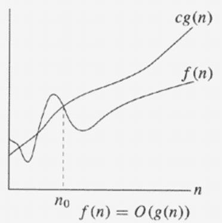
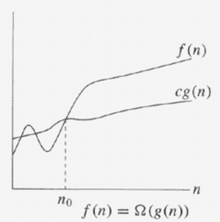
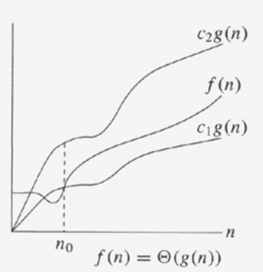

# Analysis

* Cost : 알고리즘에서 수행된 코드 라인의 비용을 나타내는 상수
* Times : 각 줄이 실행될 횟수
* Total cost :  time of algorithm = Cost * Times

### Kinds of analyses

* <b>Worst-case(usually)</b> : 크기 n의 입력에 대한 알고리즘의 최대 시간
* Average-case(sometimes) : 모든 입력값 n에 대한 알고리즘의 예상 시간
* Best-case : 크기 n의 입력에 대한 알고리즘의 최소 시간

### Machine-independent time

시간은 컴퓨터의 성능에 좌우된다.
  * relative speed (on the same machine)
  * absolute speed (on different machine)

컴퓨터에 좌우되지 않는 방법을 찾기 위해 n을 무한대로 보내 total cost 를 찾는 방법을 고안하였다.

  

# Asymptotic Analysis

Asymptotic?
  * 충분히 큰 입력값으로 함수의 한계 내 동작을 얻는 방법이다.

Asymptotic Notation
* 알고리즘의 실행 시간 증가 순서는 실행시간을 설명하는 식의 최고차수의 항으로 정의된다.
* 하위차수의 항과 상수는 무시한다.

`e.g.` an2 + bn + c -> n2

Type
* Big O
* Big Omega
* Big Theta

  

## Big O

upper bound 를 제시하는 함수이다.  

* 0 <= f(n) <= cg(n), c > 0, n0 >= 0
    * c : multiplicative constant
    * n0 : threshold

* Worst-case 를 표현할 때 쓴다

### Proof

0 <= f(n) <= cg(n) 이 성립함을 보이자.  
위 식을 만족시키는 c(c > 0)와 n0(n0 >= 0) 가 존재함을 증명할 것이다.

#### e.g.1) f(n) = 7n - 2
  * g(n) 은 f(n) 의 최고차수인 n을 받아 g(n) = n 이다.
  * 적당한 c 를 선택한다. 여기서는 c = 7 로 진행할 것이다.
  * n0 도 마찬가지로 대입해본다. n0 = 1 을 대입해보니 성립한다.
  * n이 n0 = 1 보다 같거나 클 때 f(n)이 cg(n) 보다 항상 작으므로 전제가 성립한다.
  * 따라서 f(n) = O(g(n)) 이다.

#### e.g.2) f(n) = n3 + 100n2, g(n) = n3
   * f(n) = O(g(n)) 증명
      * We clame that c > 0, n0 >= 0 that make the n3 + 100n2 <= cn3 holds for all n >= n0
      * f(n) = n3 + 100n2 <= n3 + 100n3 = 101n3 = cn3 = cg(n)
      * thus, c = 101, n = 0, 1, ... (threshold n = 0)
      * 같은 방식으로 증명한다. hence, f(n) = O(g(n))

   * g(n) = O(f(n)) 증명
      * We clame that c > 0, n0 >= 0 that make the n3 <= c(n3 + 100n2) holds for all n >= n0
      * c = 1, n = 0, 1, ... (threshold n = 0)
      * g(n) = n3 <= c(n3 + 100n2) = cf(n)
      * hence, g(n) = O(f(n))

## Big Omega

lower bound 를 제시하는 함수이다.

* 0 <= cg(n) <= f(n), c > 0, n0 >= 0
   * c : multiplicative constant
   * n0 : threshold

* Best-case 를 표현할 때 쓴다.

## Big Theta

상, 하한선을 모두 구한다.

* 0 <= c1g(n) <= f(n) <= c2g(n), c1, c2, n0 >= 0
