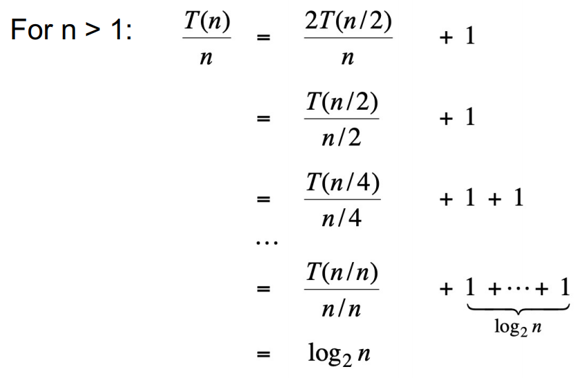

# Divide and Conquer

[Merge Sort](https://github.com/baelanche/Computer_Science/tree/master/Algorithm/Sorting/Merge%20Sort) 에서 살펴본 적이 있다.

## Proof : Recursion Tree

마찬가지로 Merge Sort 에서 살펴보았다.

## Proof : Telescoping



전제 : T(n) = nlogn  
목표 : n/2 를 없애는 방향

1. 양변을 n 으로 나눈다.
2. 구한 두번째 식을 통해 닮은 형태를 찾을 수 있다.
3. n 대신 n/2 를 대입하면 세번째 식을 구할 수 있다.
4. n/4, n/8, ... , n/n
5. T(1) 은 상수이니 지우면 logn 이 나온다.
6. hence, T(n) = nlogn

## Proof : Induction


## The master method

recurrence 의 솔루션을 찾는 하나의 cookbook 이다.

```
T(n) = aT(n/b) + f(n) (a >= 1, b > 1)
```

예시를 들어보자.

T(n) = 9T(n/3) + 5n<sup>2</sup>

1. a = 9, b = 3, f(n) = 5n<sup>2</sup> 이다.  
2. f(n)/n<sup>log<sub>b</sub>a</sup> 에 대입한다.  
3. 5n<sup>2</sup>/n<sup>2</sup> 가 나온다.  
4. 상수는 신경쓰지 말고 지수끼리 계산한다.
5. 나온 승수를 가지고 케이스를 나눈다.

|case|승수|복잡도|
|:---:|:---:|:---:|
|case 1|음수|T(n) = O(n<sup>log<sub>b</sub>a</sup>)|
|case 2|0|T(n) = O(n<sup>log<sub>b</sub>a</sup> x logn)|
|case 3|양수|T(n) = O(f(n))|
