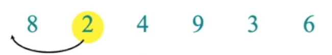
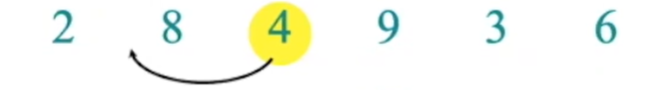
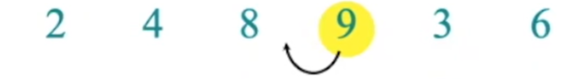
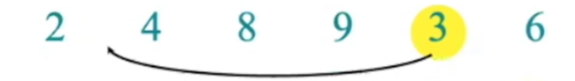

# Insertion Sort (삽입 정렬)

  * Input : (sequence) a<sub>1</sub>, a<sub>2</sub>, a<sub>3</sub>, ..., a<sub>n</sub>
  * Output : (permutation) a<sub>1</sub> <= a<sub>2</sub> <= a<sub>3</sub> <= ... <= a<sub>n</sub>

## Process

```
Input : 8 2 4 9 3 6
Output : 2 3 4 6 8 9
```

첫번째 원소는 비교할 이전 원소가 없으므로 2번째 원소부터 체크한다.

<br/><br/>



2는 8보다 작으므로 둘의 자리를 바꾼다.

<br/><br/>



첫번째 비교를 해보니 4는 8보다 작음이 성립했다.  
일단 둘의 위치를 바꾼 후 그 전 원소인 2와도 비교를 한다. 2보다는 작지 않으므로 다음 원소로 넘어간다.

<br/><br/>



9는 8보다 크므로 아무 변화가 없다.

<br/><br/>



1. 9와 비교하여 참을 보였다.(더 작다)
2. 8과 비교하여 참을 보였다.
3. 4와 비교하여 참을 보였다.
4. 2와 비교하여 거짓을 보였다.
5. 따라서 2의 다음 위치로 이동하며 4, 8, 9는 한칸씩 밀린 형태가 된다.

<br/><br/>


6도 같은 알고리즘을 적용하면 위와 같은 결과가 나온다.

<br/><br/>

### Code

```.c
#include <stdio.h>
int main() {
  int n = 6; //배열 크기
  int a[6] = {8,2,4,9,3,6};
  
  int i, key;
  for(int j=1; j<n; j++) {
    key = a[j];
    i = j - 1;
    while (i >= 0 && a[i] > key) {
      a[i+1] = a[i];
      i = i-1;
    }
    a[i+1] = key;
  }
}
```

## Proof : Loop invariants

바깥쪽 반복문에서 `j`번째의 루프 중 subarray `A[1..j-1]`는 이미 정렬된 배열이란 것을 알 수 있다.

이 것을 바탕으로 loop invariant에 대해 세가지 증명을 해야한다.
1. Initialization(루프 돌기 전)
  * Q) 첫번째 루프를 돌기 전 배열은 정렬되어 있는가?
  * A) 크기 1인 배열은 이미 정렬되어 있다. `j=1` 일때 `A[0]`는 정렬된 상태이므로 언제나 정렬된 상태임을 알 수 있다.
2. Maintenance(루프 중)
  * Q) 반복 중에 배열은 정렬되어 있는 상태라고 할 수 있는가?
  * A) 배열의 `j`번째 원소가 내부 루프에 들어갈 때 정렬되어있지 않은 상태라면, 루프 종료시 정렬된 상태가 된다.  
  외부 루프가 한번 돌 때 내부 루프는 종료 시점까지 돈다.
3. Termination(종료)
  * Q) 루프가 종료되어도 정렬된 상태인가?
  * A) 루프는 `j = n + 1`에서 종료된다. `j = n` 시점에서 모든 `j`번째 원소들은 정렬된 상태이다.

## Running time
각 라인은 상수시간이 걸린다고 가정하자.

#### 1. 루프가 없을 때  
1번째 줄은 c<sub>1</sub>의 시간, 2번째 줄은 c<sub>2</sub>의 시간, ..., n번째 줄은 c<sub>n</sub>의 시간이 걸린다.  
루프가 없다면 알고리즘의 실행시간은 c<sub>1</sub> + c<sub>2</sub> + ... + c<sub>n</sub>이 된다.  
상수시간 + 상수시간 + ... + 상수시간은 상수시간이다.  
따라서 루프가 없다면 실행시간은 상수시간이 된다.

#### 2. 루프가 있을 때  
* 루프의 횟수가 상수일 때

  루프의 횟수가 상수라면, 실행시간은 상수시간이다.

* 루프의 횟수가 상수가 아닐 때

  대부분 알고리즘은 인풋에 따라 실행시간이 정해진다.
    1. 인풋이 정렬되어 있다면 정렬에 소비되는 시간이 더 적다.
    2. 인풋의 길이가 긴 것 보다는 짧은 것이 더 빠르게 수행된다.
  
  일반적으로, 실행시간이 최악인 경우를 찾는다.

### Running time of Insertion sort

* Worst-case : 역순으로 정렬된 상태 : O(n<sup>2</sup>)
* Best-case : 정렬된 상태 : O(n)

<hr/>

# Assignment

## Exercise 1

### Insertion sort

1. insertion sort(A, n) 알고리즘의 작동원리를 설명하시오.
   1. A[1] 왼쪽에는 어떤 원소도 가지고 있지 않기 때문에 A[2] 부터 탐색을 시작한다.
   2. A[j] 에는 `현재 위치`, A[i] 에는 현재 위치의 `이전 위치`(A[j-1])를 저장한다.
   3. (0 < i) 의 범위 내에서 루프를 돌며 A[i] 가 A[j] 보다 크다면(참) 값을 교환하고 `현재 위치`가 A[i], `이전 위치`가 A[i-1] 이 된다.
   4. 조건이 참이면 3번을 반복하고, 거짓이라면 루프를 종료한다.
   5. (j+1 <= n) 를 만족할 때 A[j+1] 이 다시 `현재 위치`가 되고 2~4번을 반복한다.

2. loop invariants를 사용하여 insertion sort(A, n)의 correctness를 증명하시오.
   1. Initialization(루프 돌기 전)
      * Q) 첫번째 루프를 돌기 전 배열은 정렬되어 있는가?
      * A) 크기 1인 배열은 이미 정렬되어 있다. `j=1` 일때 `A[0]`는 정렬된 상태이므로 언제나 정렬된 상태임을 알 수 있다.
   2. Maintenance(루프 중)
      * Q) 반복 중에 배열은 정렬되어 있는 상태라고 할 수 있는가?
      * A) 배열의 `j`번째 원소가 내부 루프에 들어갈 때 정렬되어있지 않은 상태라면, 루프 종료시 정렬된 상태가 된다.  
           외부 루프가 한번 돌 때 내부 루프는 종료 시점까지 돈다.
   3. Termination(종료)
      * Q) 루프가 종료되어도 정렬된 상태인가?
      * A) 루프는 `j = n + 1`에서 종료된다. `j = n` 시점에서 모든 `j`번째 원소들은 정렬된 상태이다

3. insertion sort(A, n)의 best case 런타임을 계산과정과 함께 보이시오.

4. insertion sort(A, n)의 worst case 런타임을 계산과정과 함께 보이시오.

5. insertion sort(A, n)을 응용하여, 새로운 알고리즘 insertion sort_desc(A, n)를 작성하고(pseudo code) 그 작동원리를 설명하시오.
   insertion sort_desc(A, n)의 input과 output은 다음과 같다.
     * Input : n개의 원소로 이루어진 숫자 배열 A
     * Output : 내림차순으로 정렬된 배열 A'
