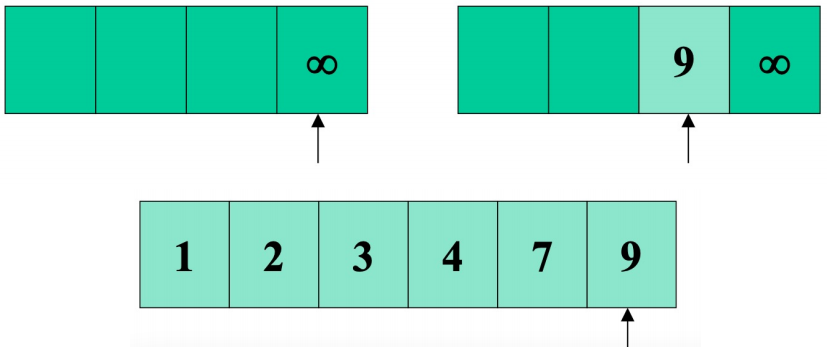

# Merge Sort (병합정렬 / 합병정렬)

Recursion 에 기반한 divide-and-conquer 알고리즘을 사용한다.

## Divide-and-conquer

* Divide : 문제를 여러 개의 작은 문제들로 접근한다.
* Conquer : 작은 문제들을 재귀적으로 해결해나간다. 
* Combine : 작은 문제들로부터 답을 찾아 본 문제를 해결한다.

### Divide-and-conquer in Merge sort

* Divide : n 크기의 배열은 n/2 크기의 배열로 나뉜다.
* Conquer : 나뉜 배열들을 재귀적으로 정렬해나간다. 배열의 크기가 1일때 종료한다.
* Conbine : 두개의 나뉜 배열들을 병합하여 정렬시킨다.

## Process


합병정렬은 재귀로 구성되어 있다. 재귀가 멈추는 순간은 작은 배열의 크기가 1일때 이다.  
conbine 과정에서 `Merge` 알고리즘을 수행한다.

### Pseudo code(Merge-sort)
```
MERGE-SORT(A[1...n],p,r)
  1. If p < r
  2. q <- fall(p+r/2)
  3. MERGE-SORT(A, p, q)
  4. MERGE-SORT(A, q+1, r)
  5. MERGE(A, p, q, r)
```

### Merge function

Merge 할 배열들은 이미 정렬되어 있는 배열이다.

#### Initial setting (L = [1, 4, 7] R = [2, 3, 9])


  
`inf : 배열의 끝을 표시하기 위한 수(배열안의 원소 중 어떤 수보다도 커야한다)`

<br/><br/>


1. 양 배열의 첫번째 원소를 비교하여 작은 값을 내려쓴다.

<br/><br/>


2. 값을 내려쓴 쪽은 다음 원소를 가리키며 다시 비교하여 마찬가지로 작은 값을 내려쓴다.

<br/><br/>


3.

<br/><br/>


4.

<br/><br/>


5.

<br/><br/>



6. R 배열에서 9를 내려쓰고 inf 를 가리킬 것이다. 양 배열의 인덱스가 inf 를 가리키면 중단한다.

<br/><br/>

Merge 하는 과정에서 비교횟수는 (r - p) + 1 이다.
```
r = 배열의 마지막 인덱스
p = 배열의 첫번째 인덱스
```

여기서 r = 6, p = 1 이므로 n = (r - p) + 1 = 6 이다.

---

### Code


## Proof : Loop invariants

1. Initialization : 루프를 시작할 때 A[p...k-1]
2. Maintenance : 
3. Termination : k = r + 1 일때 루프가 종료된다.  
    r = k - 1 이므로 A[p...k-1] -> A[p...r] 이 된다.
    
## Running Time

input size : n
T(n) : Running time
D(n) : divide  
C(n) : combine

if (n <= c) : n이 constant이다. 다루지 않음

Best case : n = 1
Divide : 
Conquer : 
Conbine : n

Divide step : 길이가 n 일때 트리 형태로 배열이 쪼개질 것이다. 이 때 스텝이 k 일때 배열의 갯수는 2<sup>k</sup> 이다.
height는 logn 이다.  
결과적으로 log<sub>2</sub>n + 1 의 단계 , total cost : cn(log<sub>2</sub>n + 1) -> 최고차항만 남긴다. hence, O(nlogn) 이다.

## Conclusions

* O(n<sup>2</sup>) 인 Insertion sort 보다 성능이 좋다.
* 실제로, n > 30 일때 Merge sort 가 Insertion sort 보다 빠르게 동작한다.
