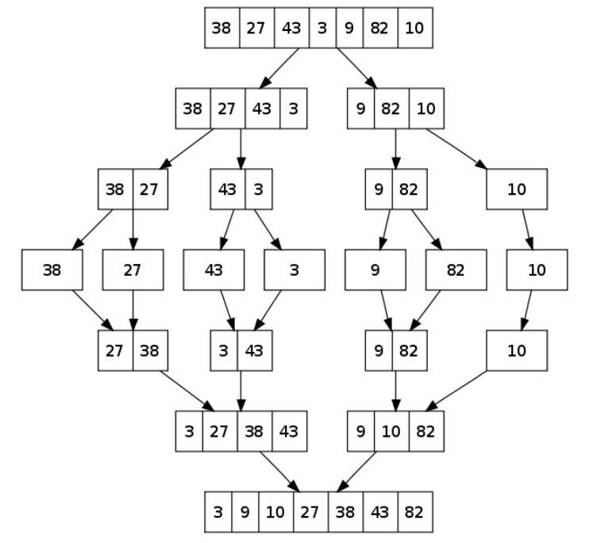
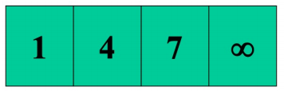
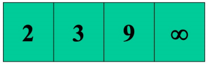
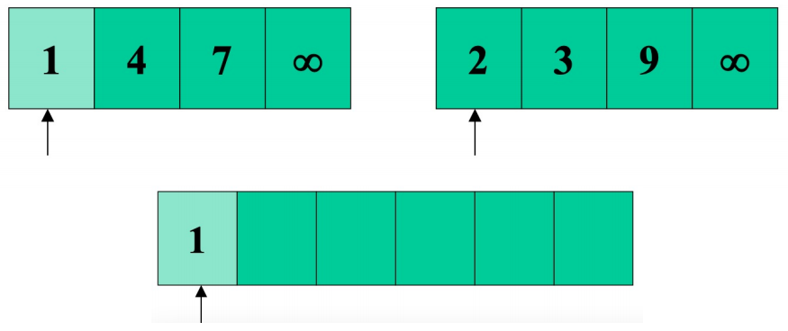
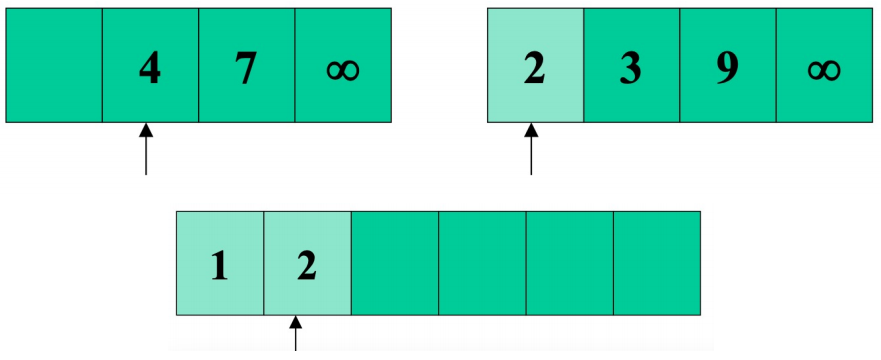
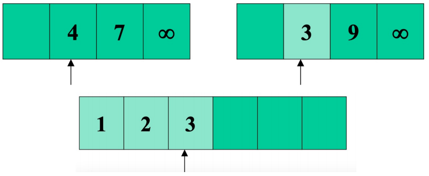
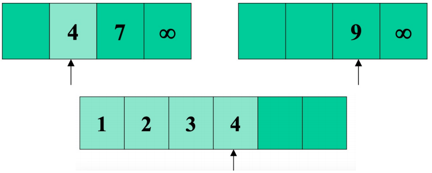
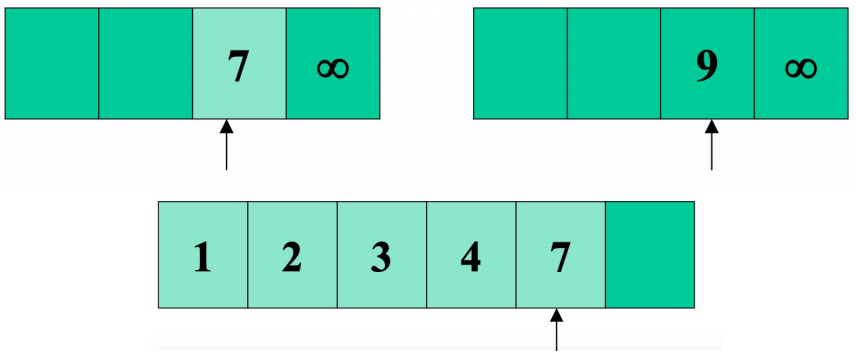

# Merge Sort (병합정렬 / 합병정렬)

Recursion 에 기반한 divide-and-conquer 알고리즘을 사용한다.

## Divide-and-conquer

* Divide : 문제를 여러 개의 작은 문제들로 접근한다.
* Conquer : 작은 문제들을 재귀적으로 해결해나간다. 
* Combine : 작은 문제들로부터 답을 찾아 본 문제를 해결한다.

### Divide-and-conquer in Merge sort

* Divide : n 크기의 배열은 n/2 크기의 배열로 나뉜다.
* Conquer : 나뉜 배열들을 재귀적으로 정렬해나간다. 배열의 크기가 1일때 종료한다.
* Conbine : 두개의 나뉜 배열들을 병합하여 정렬시킨다.

## Process



합병정렬은 재귀로 구성되어 있다. 재귀가 멈추는 순간은 작은 배열의 크기가 1일때 이다.  
conbine 과정에서 `Merge` 알고리즘을 수행한다.

### Pseudo code(Merge-sort)
```
MERGE-SORT(A[1...n],p,r)
  1. If p < r
  2. q <- fall(p+r/2)
  3. MERGE-SORT(A, p, q)
  4. MERGE-SORT(A, q+1, r)
  5. MERGE(A, p, q, r)
```

### Merge function

Merge 할 배열들은 이미 정렬되어 있는 배열이다.




L = [1, 4, 7] R = [2, 3, 9]  
`inf : 배열의 끝을 표시하기 위한 수(배열안의 원소 중 어떤 수보다도 커야한다)`







1. 양 배열의 첫번째 원소를 비교하여 작은 것을 내려쓴다.
2. L 배열에서 원소가 빠졌으므로 다음 원소를 가리켜 비교한다.
3. 같은 매커니즘으로 계속 비교하며 양 배열의 인덱스가 inf 를 가리키면 중단한다.

횟수 : n = (r-p)+1
