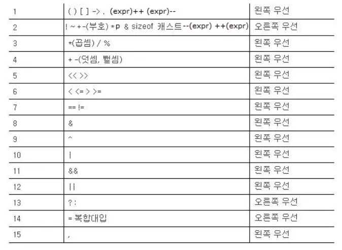

# 연산자의 종류

* 산술 연산자 : +, -, *, /, %
* 대입 연산자 : =
* 증감 연산자 : ++, --
* 비트 연산자 : &, |, ^, >>, <<, ~

## 우선순위



오름차순으로 높은 우선순위를 가진다.

왼쪽 우선은 왼쪽 -> 오른쪽 순으로 우선순위, 오른쪽 우선은 오른쪽 -> 왼쪽 순으로 우선순위를 가진다는 뜻이다.

왼쪽 우선 - `a = a + b + c` : a + b 를 먼저 하고 그 결과에 + c 를 한다

오른쪽 우선 - `a = b = 3` : b = 3 이 대입되고 a = b 를 한다

## 증감 연산자

### prefix / postfix

증감 연산자는 `a++` `++a` 와 같은 형태로 사용하는데 이 둘은 약간의 차이가 있다.

* a++ : 결과를 돌려준 후 1을 더함
* ++a : 1을 더한 후 결과를 돌려줌

#### 예제
```.c
int a = 1;
printf("++a : %d\n", ++a);
a = 1;
printf("a++ : %d\n", a++);
printf("a : %d\n", a);
// ++a : 2
// a++ : 1
// a : 2
```

첫번째는 1을 더한 후 결과를 출력하므로 2가 출력된다.

두번째 후위 증감식에서는 결과를 출력한 후 1을 더하므로 1을 출력한 후 a는 2가 된다.

#### `a = a + 1` vs `a++`

둘은 무슨 차이가 있을까?

`a++` 이 `a = a + 1` 보다 우선순위가 높지만 결과에는 차이가 없다.

하지만 둘은 약간(아주아주 약간)의 성능의 차이가 존재한다. (어셈블리 언어의 성능이 증감연산자가 조금 좋다)

그래서 컴파일러가 컴파일시 `a = a + 1`과 같은 식을 `a++`로 알아서 바꾸어 버린다.

## 비트 연산자

true, false 여부를 정할때 자주 사용한다.

### AND(&)

두 값이 모두 1일때만 1을 반환한다 : 곱연산

### OR(|)

두 값이 모두 0일때만 0을 반환한다 : 합연산

### XOR(^)

두 값이 서로 다를때만 1을 반환한다

### NOT(~)

값을 반전시킨다

### <<

왼쪽으로 시프트한다 = 왼쪽으로 한비트 옮긴다

한 비트 올리면 2배만큼 커지므로 결과는 값에 2를 곱한것과 같다. `2^31은 1<<31와 같다`

시프트되어 자리가 없어진 비트는 버려지고 오른쪽에 새로 채워지는 비트는 0으로 채워진다.

`10101100 << 1 = 01011000`

### >>

오른쪽으로 시프트한다 = 오른쪽으로 한비트 옮긴다

시프트되어 자리가 없어진 비트는 버려지고 왼쪽에 새로 채워지는 비트는 시프트 이전에 왼쪽 맨앞에 있던 수로 채워진다.

`11100010 >> 1 = 11110001`

<hr/>

### 서로 다른 자료형을 연산하면 어떤 결과가 나올까?

```.c
int a = 10;
float b = 3.0f;
printf("%d", a/b);
```

위 코드를 수행하면 가비지값이 나온다.

서로 다른 자료형이 연산을 하게 되면 더 큰 자료형쪽으로 작은 자료형이 캐스팅하게 된다.

이 경우에는 int 가 float 형으로 변환되어 나누기를 하는 셈이다.

결과적으로 실수끼리의 연산이니 %f로 출력을 해주어야 한다.

### 제곱을 하는 여러가지 방법

#### 1. math.h 의 pow() 함수를 이용한다

    pow() 함수는 파라미터로 double형 변수를 두개 받는다.
  
    첫번째 파라미터는 밑, 두번째 파라미터는 지수를 뜻한다.
  
    ```.c
    #include <math.h>
    float f = pow(2.0f, 31.0f);
    printf("%0.f\n", f);
    // 2147483648
    ```
#### 2. 시프트 연산자를 이용한다

    int 형의 범위를 벗어나는 수를 구하고자 할때에는 아래처럼 한다.

    ```.c
    long long a = 1LL << 31;
    printf("%lld", a);
    // 2147483648
    ```
    
    1 << 31 과 같이 써준다면 1이 long long 인것을 컴파일러가 모르기 때문에 default 자료형인 int 형을 붙여버린다.
    
    float 형을 쓸때와 마찬가지로 뒤에 무슨 자료형인지 명시해주어야 한다.
    
    > 1LL, 1ll 둘다 되는데 무슨 차이인지는 잘 모르겠다. 1LL이 눈에 잘 들어오므로 저렇게 썼다.
