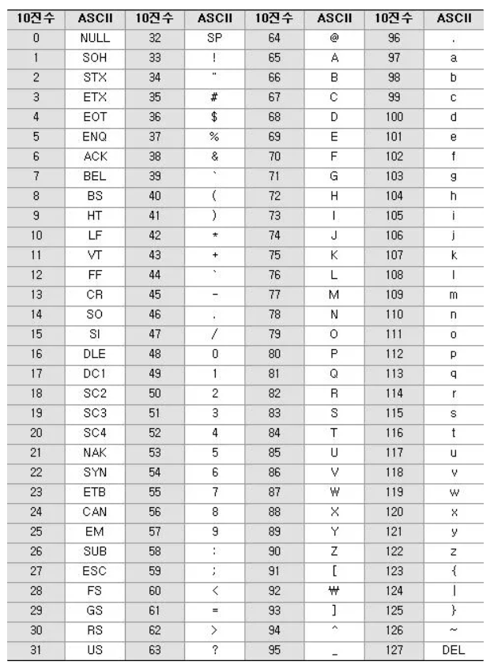

# 문자

character 를 뜻하는 char 자료형은 문자를 표현할 수 있는 자료형이다.

```.c
char c = 'a';
printf("%c", c);
```

이와 같이 문자를 표현할 때에는 ' ' 로 묶어주고 %c 로 출력한다.

```.c
char c = 'a';
printf("%d", c);
```

정수형태로 출력하면 97이 나온다. 이는 오류가 아니다.  
컴퓨터는 문자를 인식하지 못한다. 하지만 사람은 문자를 표현해야하기 때문에 숫자에 각 문자를 대입시켰다.

### ASCII



8비트로 문자를 표현하는 아스키코드이다. 아스키코드는 7비트만을 사용했고 후에 128가지 방식으로는  
문자를 표현할 수 없게되자 256개(8비트)로 확장하게 됐다.  
256개로도 부족하게 되자 유니코드 문자 체계를 도입한다. 유니코드는 1 ~ 4bytes 로 문자를 처리한다.  
이는 아스키코드 체계를 유지하면서 새로운 문자들을 처리하기 위해서이다.

# scanf

```.c
#include <stdio.h>
int main() {
  int a;
  printf("정수를 입력하세요 ");
  scanf("%d", &a);
  
  printf("%d\n", a);
}
```

표준출력은 모니터로 계속 해왔고 이번에는 표준입력을 키보드로 하는 모습이다.  
scanf 는 엔터를 입력할 때까지 입력을 계속 기다리는 함수이다.  
printf 와 마찬가지로 받는 변수의 타입을 위와같이 서술해주어야 한다.


# scanf_s

```
 scanf_s 를 사용하라는 의미는 scanf 가 입력받는 데이터의 크기를 확인하지 않기 때문에 버퍼 오버플로우가
 발생할 수 있기 때문이다.
   #ifdef _MSC_VER
   #define _CRT_SECURE_NO_WARNINGS
   #endif
 이 문구를 상단에 입력하면 에러없이 진행할 수 있다.
```
