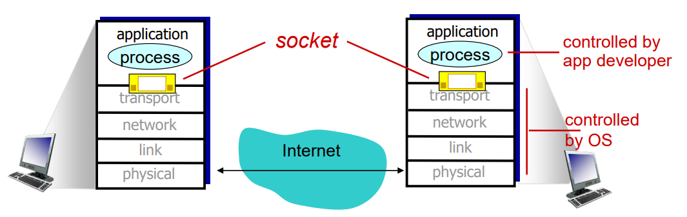
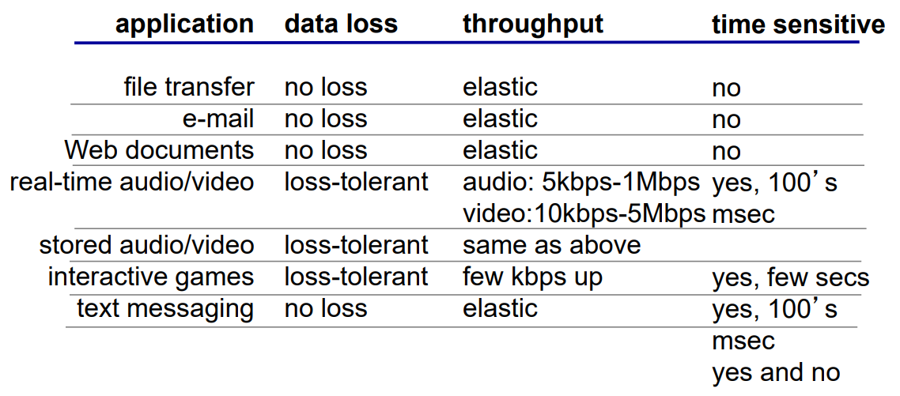

# Application Layer

레이어의 최상위에 위치하며 사용자와 가장 밀접한 소프트웨어들이 이에 속한다.  
소프트웨어를 직접 구동하는 end system 에서 동작한다. end system 간에서 네트워크를 통해 소통한다.  
application 은 네트워크 core 와는 무관하다. (계층 구조의 장점 : 다른 계층에서 이를 처리한다)

## Application Structure

1. client-server
2. peer-to-peer

### Client-server architecture

#### 1. server
  * 항상 켜져있다.
  * IP 가 고정되어있다.
  * 데이터 센터, 클라우드 등을 통해 서비스한다.

#### 2. client
  * 동적 IP 주소를 가지고 있다. (고정 IP 를 갖는 것이 불가능한 것은 아니지만, IP 가 충분하지 않다)
  * 클라이언트들은 서로 통신할 수 없다. (서버를 통해야 한다)

### P2P architecture

* 항상 켜져있지 않다.
* end systems 들이 직접 통신한다.
* peers 들은 서로 서비스를 요청하고 제공받는다.
* peers 들은 항상 연결되어 있는 것이 아니며 연결때마다 IP 가 바뀐다.

## Process Communicating

* 같은 호스트 내에서 여러개의 프로세스가 동작할 때에는 IPC(Inter-process communication)를 통해 통신한다.
* 다른 호스트 사이에서 프로세스가 통신할 때에는 `메세지` 를 통해서 한다.
* P2P 에서는 클라이언트 프로세스와 서버 프로세스가 모두 존재한다.

### Sockets

* 프로세스들이 메세지를 주고 받을때 소켓을 통해 주고 받는다. (프로세스 사이의 문과 같다)
* 트랜스포트 계층을 통해 주고 받는다.

### Addressing processes

메세지를 주고 받기 위해서는 프로세스를 구분하는 식별자가 필요하다. 호스트의 고유 식별자인 IP 와 port number 라는 것을 통해 프로세스를 구별하는 방법이 생겨났다.

* e.g., HTTP : 80, mail : 25

### Application protocol

* 교환된 메세지의 타입을 정의한다. (e.g., request, response)
* 메세지의 필드를 정의한다.
* 필드의 의미를 정의한다.
* 메세지를 주고 받을때의 규칙을 정의한다.

#### what does app need?

1. data integrity : 데이터 전송시 손상이 없어야 한다. (음성 등의 데이터는 약간의 손실이 있어도 된다)
2. timing : 지연 시간이 적어야 한다. (실시간 게임, 인터넷 통화 등)
3. throughput : throughput 의 보장이 필요한 앱, 필요하지 않은 앱이 있다.
4. security

 

  

앱의 특성별로 원하는 것이 제각각이다. 그래서 transport layer 에서 전송 규약을 정의하도록 했다.

## TCP, UDP

1. TCP
  * 신뢰성 있는 전송
  * 속도의 유연성
  * 네트워크 혼잡의 고려
  * timing, throughput, security 를 보장하지 않는다.
  * 연결 지향적이다.

2. UDP
  * reliability, flow control, congestion control, timing, throughput, security ... 등을 제공하지 않는다.
  * 신뢰성이 떨어져도 되는 음성, 영상 등의 데이터를 보낼 때 주로 쓴다.

### SSL

TCP 와 UDP 는 암호화를 제공하지 않는다.  
TCP 연결 중 보안을 제공하기 위해 SSL 이라는 프로토콜이 만들어졌다.

* application layer 에서 동작한다.
