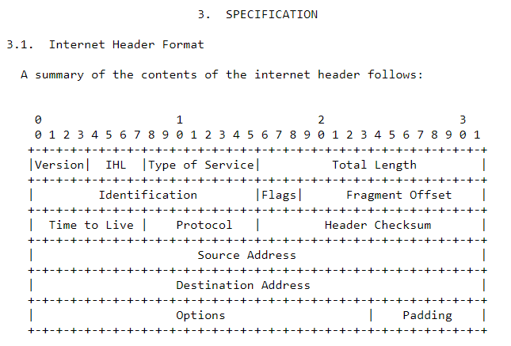
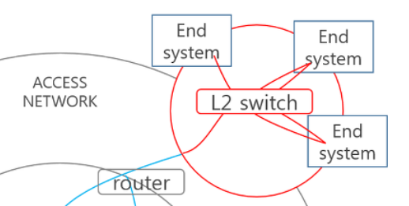
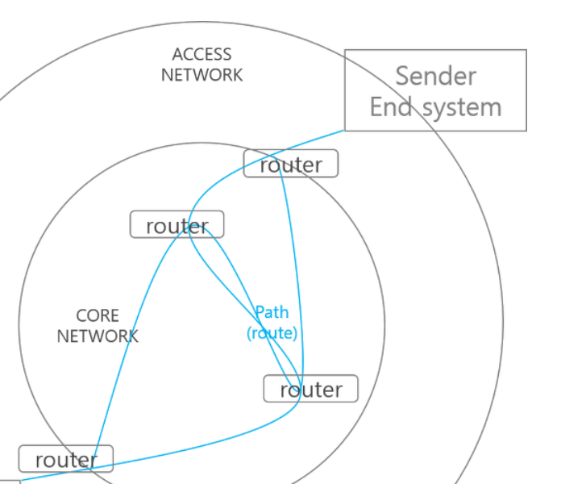
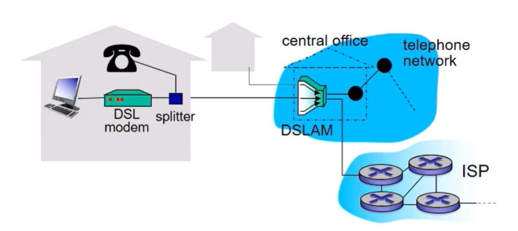
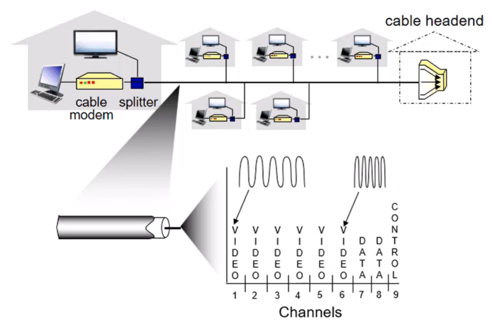
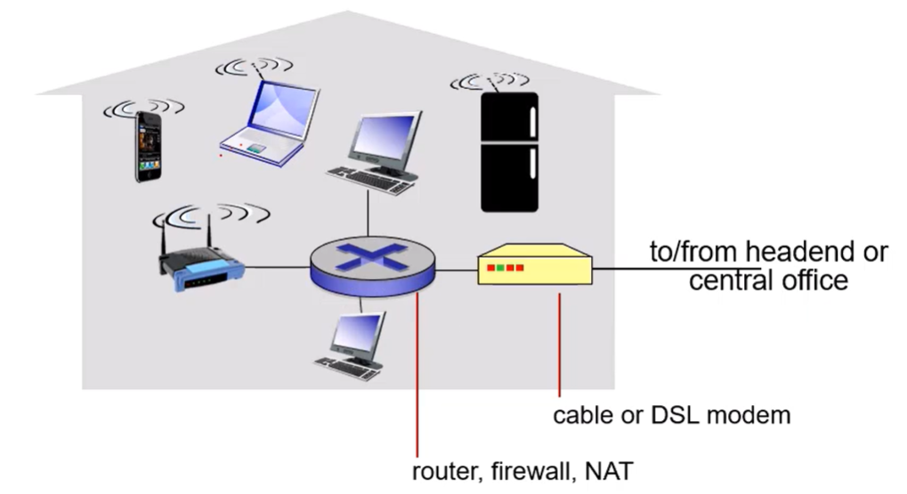
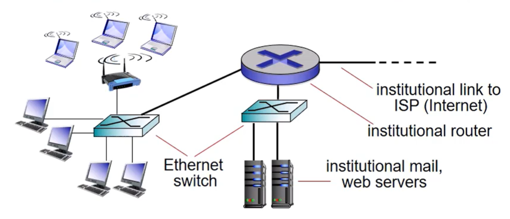
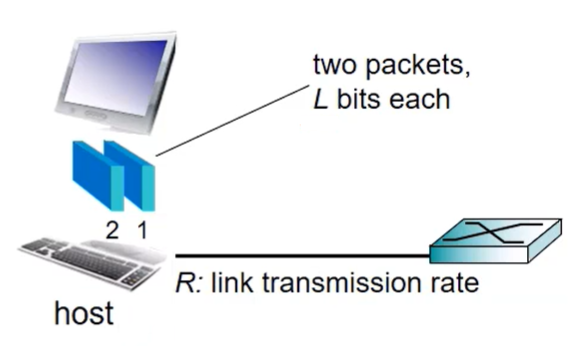

# Internet?

### "Network of networks"

PC, server, laptop, smartphone 등 수백만개의 디바이스가 컴퓨터 네트워크에 연결되어 있다. 이러한 환경을 인터넷이라 한다.  
또 각 디바이스를 <b>host</b> 또는 <b>end systems</b> 라고 부른다.

디바이스들이 소통하기 위해선 이들을 연결해줄 communication links 가 필요하다. 이 link 는 선의 존재 유무로 나뉜다.
* wireless links : radio spectrum, satellite
* wired links : fiber, cooper

서로 다른 재질들로 된 link 들은 각각 다른 전송 rate 를 가지고 있는데, 이를 transmission rate 라고 한다.

네트워크를 통해 데이터(chunks of data)를 보낼 때 packet 이라는 가공된 형태로 보낸다.  
이 때 communication link 가 서로 다르다면 <b>router</b> 를 통하여 보낸다. 이러한 역할을 하는 router 를 packet switch 라고도 한다.

host 들은 ISP(Internet Service Provider)를 통해 인터넷에 접속한다. ISP는 SK, KT, LG 등의 통신사를 일컫는다.  

# Protocol?

네트워크의 노드들 사이의 메세지 형식, 송/수신 메세지의 순서 등의 전반적인 규약을 뜻한다.  
넓은 생태계를 중재해야 하므로 IETF라는 단체에서 Internet Standard를 정의하고 있다.  
여기서 만든 문서를 RFC라 하며 ietf.org 에서 확인할 수 있다.

e.g. RFC에서 Internet Protocol에 대해 정의한 문서

## Switch & Router

### switch

일반적으로 Access network에 사용된다.

### router

더 안쪽에 있는 Core network에 사용된다.

## Access network

### Digital subscriber line(DSL)

음성, 데이터가 전용회선을 통해 서로 다른 주파수로 central office로 전송된다. 이 office에는 DSLAM으로 가는 전화선이 있다.
  * DSL 전화선을 통을 통한 데이터는 인터넷에 연결된다.
  * DSL 전화선을 통을 통한 음성은 전화망에 연결된다. 

  

### Cable network

주파수 분할 멀티플렉싱 - 서로 다른 주파수 대역으로 전송되는 다른 채널
  * 비대칭적 : 최대 30Mbps 다운스트림 전송 속도, 2Mbps 업스트림 전송 속도
  * DSL과 달리 central office와 직접 접근한다.
  * 주파수가 섞여서 날아가도 수신측에서 주파수를 분리해낼 수 있다.

  

### Home network

-

  

### Ethernet(Enterprise access networks)

* 일반적으로 회사, 대학 등의 집단에서 사용한다.
* 10Mbps, 100Mbps, 1Gbps, 10Gbps 등의 전송률을 가졌다.
* 요즘은 속도가 워낙 빨라져서 end system 에서 Ethernet 에 접속한다.

  

### Wireless access networks

shared wireless access network connects end system to router
  * wireless LAN: 건물 규모
  * wireless wide-area access network(WWAN): 무선 광역 통신망. 3G, 4G 등을 일컫는다.

  

## Host

역할 : 데이터 조각(packets)을 보낸다.

host 전송 방식
  1. 메세지를 쓴다.
  2. L 비트 길이의 작은 조각(패킷)으로 쪼갠다.
  3. R의 전송률로 access network로 패킷을 전송한다.

### Packet transmission delay

* link transmission rate / link capacity / link bandwidth

  

## Physical media

* bit: 송신기/수신기 사이의 전파
* physical link: 송신기/수신기 사이에 존재하는 선
* guided media: 유선
* unguided media: 무선
* twisted pair(TP): 두개의 꼬인 절연선
* coaxial cable: 동심원 전도체 두 개
* fiber optic cable: 광케이블, 전송률 높음, 가벼운 펄스를 전달하는 유리 섬유, 장거리
* radio: 무선
  * terrestrial microwave, LAN, wide-area, satellite
