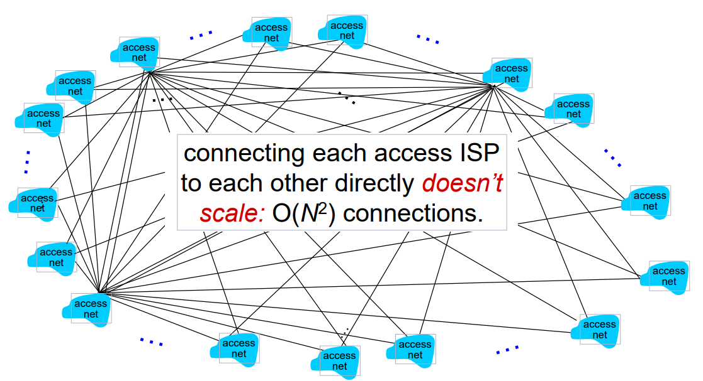

# Network core
* packet switching
* circuit switching
* network structure

 

## Packet-switching (shared)

bandwidth 를 공유(shared)하는 방식이다.  
호스트가 작은 조각인 패킷으로 데이터를 전송하며 데이터를 전송하는 동안만 자원을 사용한다.

각 패킷은 L bits 를 가졌다.  
link 의 bandwidth 는 R이며 패킷이 전송 될 때 L/R 초가 걸린다.

* store and forward : 라우터에 L bits 전체가 store 된 후 전송하는 방식이다.  
* end-end delay : propagation delay 가 0이라는 가정 하에 그림에서 두번의 링크를 타니까 delay 는 2xL/R 이다.
* hop : one-hop transmission delay 는 L/R 이다. hop은 link를 뜻하며 위 그림은 two-hop 이다.

### Queueing delay, loss

 

다수의 사용자들이 bandwidth를 공유하기 때문에 패킷스위칭이 단순하게 이루어지지는 않는다.

A, B가 동시에 데이터를 보낸다. 데이터는 섞여져서 전송되게 되는데, 데이터가 몰리면 날아가는 패킷보다 쌓이는 패킷이 많아진다. 이것이 큐잉이다.  
전송될 패킷이 지연되는 현상을 큐잉 딜레이라 한다. (arrival rate 가 transmission rate를 넘어서게 되면 큐잉이 생긴다)  
트래픽이 몰리면 인터넷이 느려지는 이유가 이것이다. 큐의 길이는 컴퓨터에서 할당한 유한의 메모리이며, 길이를 넘어서게 되면 초과된 데이터는 버려지게된다. (loss)

메모리를 더 할당해 큐의 길이를 늘리면 loss 를 해결할 수 있을까?  
아마 큐잉딜레이가 엄청 길어지면 큐의 길이만 길어졌을 뿐 별다른 효과는 없을 것이다.

### Two key network-core functions

1. routing : 데이터가 라우터에 오면 나가는 경로가 어디인지 결정하는 알고리즘. 데이터가 주소가 쓰여있다. (주소 : header)
2. forwarding : 라우터의 입구에서 출구로 패킷을 옮기는 알고리즘.

## Circuit-switching (dedicated)

 

시작지, 도착지 주소 자원을 할당한다.  
대역폭을 따로 쓰기 때문에 bandwidth 를 사용자별로 나눌 필요가 없다. (큐잉딜레이 안생김, 패킷손실 없음)  
항상 대역폭을 점유하므로 사용률이 떨어지면 대역폭 낭비된다. 전화 회선에 적합하다. 전화 걸면 한개의 서킷 할당하여 사용한다.

* 서킷의 개수 : bandwidth가 있고 bps가 있다. 동시에 통화할 수 있는 사용자 수가 보통 제한되어있다.
* 대역폭이 꽉차면 통화를 못하게된다 -> 통화중으로 표시

### FDM vs TDM

더 많은 사용자를 위해 만들어낸 다중화 기법이다.

Frequency Division Multiplexing / Time Division Multiplexing

* FDM : 주파수를 쪼개서 사용자별로 분배한다. 아날로그 방식에서 주로 사용한다.
* TDM : 시간별로 유저에게 주파수를 할당한다. 아날로그 방식으로는 불가능하며 디지털 방식에서 사용한다.

### Packet switching vs Circuit switching

사용자를 더 많이 받아들일 수 있는 것은 패킷 스위칭이다.

#### e.g.

bps : 1 Mbps link
users : 100 kb/s, active 10% of time

일 때, 어떤 방식이 사용자를 더 받아들일 수 있는가?

#### 서킷스위칭 : 10명  
100kb 씩 10명이 사용하면 된다.

#### 패킷스위칭 : 35명  
35명 중 10명이 동시에 패킷을 보낼 확률을 계산해보니 0.0004 보다 작다고 한다. 이는 구하는 공식이 따로 있다.

인터넷의 대부분이 패킷스위칭 방식이다.  
일반적으로 유저들은 가끔씩, 그리고 한번에 많은 양의 활동을 하는데 이런 패턴 없는 방식에는 패킷스위칭이 좋다.
패킷 스위칭은 리소스를 공유하기 때문에 이런 패턴에 효과적이며, 그냥 보내면 라우터들이 경로를 설정해주므로 단순함에 있어서도 좋다.  
물론 예상치 못한 인원이 몰렸을 때 혼잡한 상황이 생길수는 있다.

패킷 스위칭으로 circuit-like 한 동작은 어떻게 제공하는가?
인터넷에 이러한 솔루션은 잘 적용되지 않는다. (대역폭이 충분하기 때문이다)
심지어 Skype(VoIP) 와 같은 <b>음성데이터</b>를 송/수신할때 패킷 스위칭을 사용하는데, 일반적으로 잘 동작한다.
물론 트래픽이 몰리면 끊김이 생기게 된다. 이는 여전히 해결되지 않은 문제다.

## Internet structure : network of networks

엔드 시스템은 ISP를 통해 인터넷에 접속한다.  
노드들을 연결해주는 ISP는 어떤식으로 연결해주는가? ISP를 여러개 만들것인가, 한개만 만들것인가?  
이런 물음들은 재정적 문제와 국가의 협약에 결정되는 부분이 크다.

### Q) 수백만개의 access network를 ISP는 어떻게 연결하나?

   

### A1)  
O(N^2) 개의 연결을 할 수 있다.  
이 방식은 모든 access network 를 다 연결하는 방식으로 연결의 개수가 지수적으로 증가한다.  
언뜻 보아도 좋은 방식은 아니다.

   

### A2)
global ISP 를 중앙에 둔다. ISP 는 그대로 두면서 access network 가 생겨나면 하나씩 붙인다.  
global ISP 가 전세계에 한개만 있는 것이 불가능 한건 아니다. 하지만 자연스레 경쟁업체가 생기게 되었다.
다른 global ISP 가 생긴다면 global ISP 들 끼리도 연결되어 있어야 한다.

   

### A3)  
global ISP 가 3개가 있는 모습이다. IXP 라는 router 를 통해 ISP 를 연결하였으며 regional newtork 라는 지역의 네트워크들을 묶는  
소규모 네트워크도 생겨났다.

   

### A4)
자연스레 레이어별 ISP들이 설계되었다.

