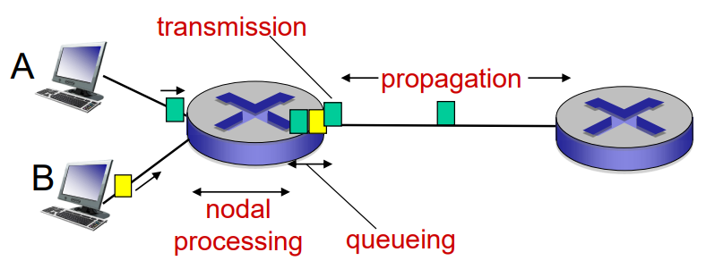
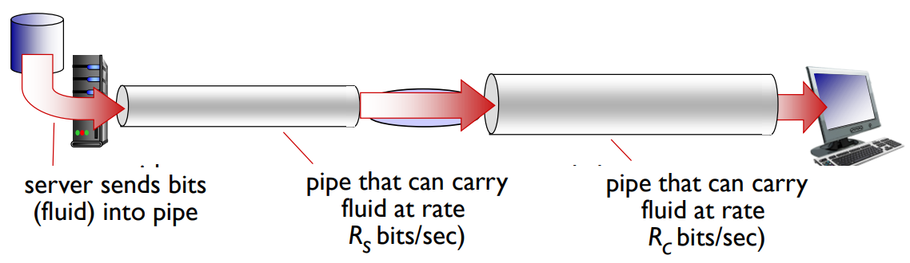
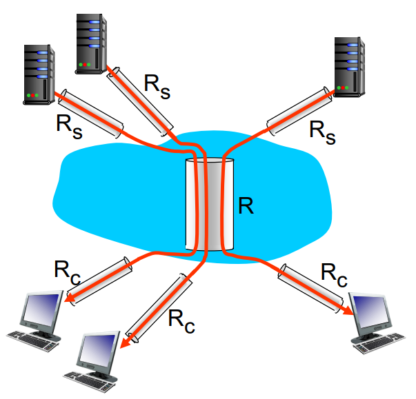

# Performance

* delay
* loss
* throughput

## 손실과 지연은 어떻게 발생하는가?

패킷은 라우터 버퍼에 큐(queue)된다.  
패킷의 arrival rate 가 link capacity 를 초과하면 딜레이가 발생한다.

### Four sources of packet delay

* processing delay
* queueing delay
* transmission delay
* propagation delay

#### processing delay

비트를 체크하고 링크(매질)을 결정하는 시간을 말한다.

#### Queueing delay

전송을 위해 큐에서 대기하는 시간을 말한다.

#### transmission delay

L/R 을 말한다.

#### propagation delay 

링크를 통해 날아가는 시간이다.  
물리적 링크의 거리가 d 이고 전파의 속도가 s 일때 딜레이는 d/s 이다.

### Caravan analogy

열개의 차가 서로 100km 떨어진 톨게이트를 통과한다.  
차 한대가 톨게이트에서 걸리는 시간이 12초, 차의 주행속도는 100km/h 이다.  
모든 차가 두번째 톨게이트를 통과하는데 걸리는 시간은 얼마인가?

* 톨게이트에서 걸리는 시간은 총 120초, 100km 의 거리를 100km/h 로 가면 1시간이 걸린다. 따라서, 첫번째 차가 첫번째 톨게이트를 통과하는 시점부터 마지막 차가 두번째 톨게이트를 통과하는 시점까지 62분이 걸린다.
* transmission delay + propagation delay

## Queueing delay

* R : link bandwidth
* L : packet length
* a : average packet arrival rate

1. L*a/R 이 0에 가깝다 : 큐잉 딜레이가 거의 없다.
2. L*a/R 이 1에 가깝다 : 큐잉 딜레이가 크다.
3. L*a/R 이 1보다 크다 : 일하는 속도보다 제공되는 속도가 빠르다. -> 무한대의 딜레이

## Packet loss

큐가 꽉차면 새로운 패킷은 버려진다.  
버려진 패킷은 이전 노드에 갈 수도 있고, 혹은 엔드 시스템에 갈 수도 있고, 모두 아닐 수도 있다.

## Throughput

단위 시간 동안 교환된 데이터의 양을 일컫는다.
rate(bits/time) bandwidth 가 고정되어 있어도 throughput 은 고정되어 있지 않다.

서버에서 F bits 를 클라이언트에 보냈다.  
1. 첫번째 링크 - Rs - small capacity
2. 두번째 링크 - Rc - big capacity

실제 보내는 throughput 은 작은 쪽으로 결정된다.

### bottleneck link

capacity 가 작은 쪽의 link를 bottleneck link라 한다.  
한 쪽의 capacity 가 커도 작은 쪽의 link 에서 처리 속도가 느리기 때문에 작은 쪽에 맞추게 된다.

이 문제를 해결하기 위해 TCP 가 도입되었고 데이터 전송률을 그때 상황에 맞게 조절한다.

#### throughput_internet

여러개의 서버, 클라이언트들이 bandwidth를 공유하는 상황이다.  
10개의 커넥션이 R을 쓰고 있다고 할때, 각 Rc, Rs, ... 들을 10으로 나누고 이 중 가장 작은 것이 throughput 이 된다.  
일반적으로 코어는 대역폭을 높게 설계하기 때문에 중간에서 bottleneck 이 발생하지는 않는다.
