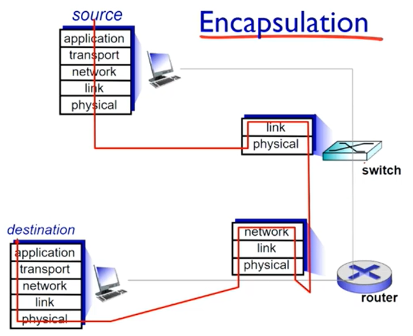

# Protocol Layers

layers : 서비스를 구현하는 각 계층
* 계층과 계층 사이의 내부 계층을 통해 움직인다.
* 아래 계층에서 제공한 서비스에 따라 움직인다.

## layering?

* 복잡한 시스템 간의 관계 구조를 명확히 한다.
* 시스템의 업데이트, 유지보수를 더 쉽게 한다.(모듈화)
  * 계층별 관리를 통해 유지보수가 간편해졌다.

### Internet protocol stack

|layer|역할|종류|
|:---:|:---:|:---:|
|application|네트워크 애플리케이션을 지원하는 계층|FTP, SMTP, HTTP|
|transport|프로세스 간 데이터 전송|TCP, UDP|
|network|시작과 도착 지점의 주소를 안내하는 계층|IP, routing protocols|
|link|인접 계층간의 데이터 전송|Ethernet, WiFi, PPP|
|physical|물리적인 유/무선 매체||

  

### ISO/OSI reference model

최초의 규격 모델이다.

|layer|역할|종류|
|:---:|:---:|:---:|
|application|||
|presentation|암호화, 압축, 등 애플리케이션이 데이터를 해석할 수 있게 함||
|session|동기화, 데이터 교환 중 손실 보장||
|transport|||
|network|||
|link|||
|physical|||

application, presentation, session 계층이 합쳐져서 Internet protocol stack 의 application 계층이 되었다.

## Encapsulation

source 에서 destination 까지 데이터를 전송할 것이다.

* 전송 호스트 : 각 계층을 타면서 각각의 헤더가 붙는다.
  1. application 계층에서 데이터를 받는다. | M |
  2. transport 계층에서 헤더를 붙인다. | Ht | M |
  3. network 계층에서 헤더를 붙인다. | Hn | Ht | M |
  4. link 계층에서 헤더를 붙인다. | Hl | Hn | Ht | M |
* 스위치 : 링크 계층 까지의 헤더를 읽어서 MAC address 를 이용해 어디로 보내야할지 결정한다.
* 라우터 : 네트워크 계층 까지의 헤더를 읽어서 IP 주소를 이용해 어디로 보내야할지 결정한다.
* 수신 호스트 : 계층을 역순으로 타면서 데이터를 얻는다.
  1. 각 계층에서는 자기의 계층과 동일한 헤더만을 읽는다.
