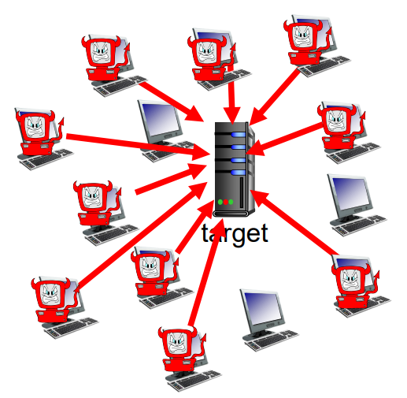
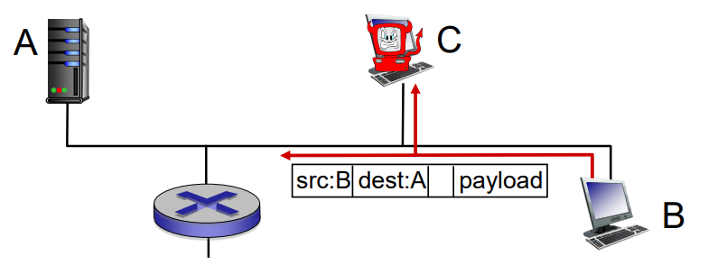

# Network security

초기의 인터넷은 신뢰하는 사용자들을 그룹으로하여 운영되었으며 보안이라는 개념이 없었다.  
그러나 네트워크를 공격 혹은 데이터를 갈취하는 행위가 등장하면서 공격을 막는 디자인이 설계되기 시작했다.  
보안은 모든 계층에서 설계된다.

## Put malware into hosts via Internet

* malware 는 두가지 방식으로 호스트에 들어온다.
  1. virus : 오브젝트를 받거나 실행했을 때 감염
  2. worm : 오브젝트를 받기만 했는데 감염

* spyware malware : 키 입력을 기록할 수 있다.
* botnet : 감염된 호스트들로 구성된 네트워크

## Attack server, network infrastructure

* Denial of Service (DOS) : 소화하지 못할 자원을 전송함으로써 트래픽을 넘치게하여 대상의 자원을 사용하지 못하게 만듦
  1. 타겟 설정
  2. 호스트 근처의 네트워크에 침입한다
  3. 타겟에게 데이터를 보낸다

* 일반적인 메세지를 보낸다는 점이 특징이다.

## Packet sniffing

* broadcast media 환경에서 발생한다. (shared Ethernet, wireless)

1. B 가 A 에게 데이터를 보낸다.
2. C 가 데이터를 취한다. (A 도 데이터를 받는다)
