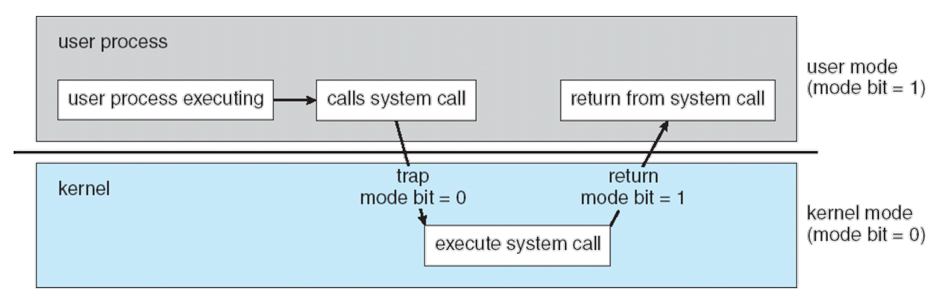
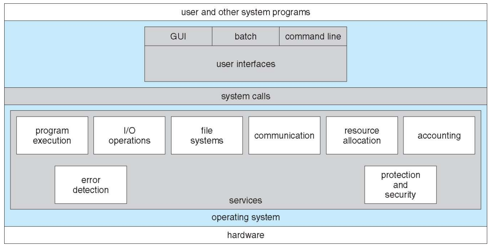
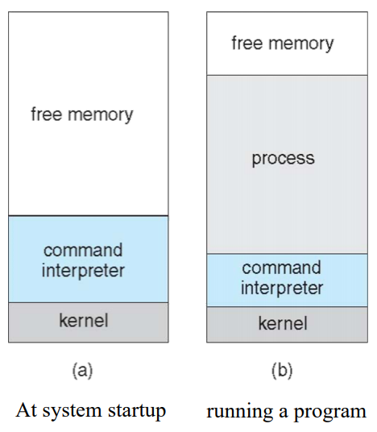
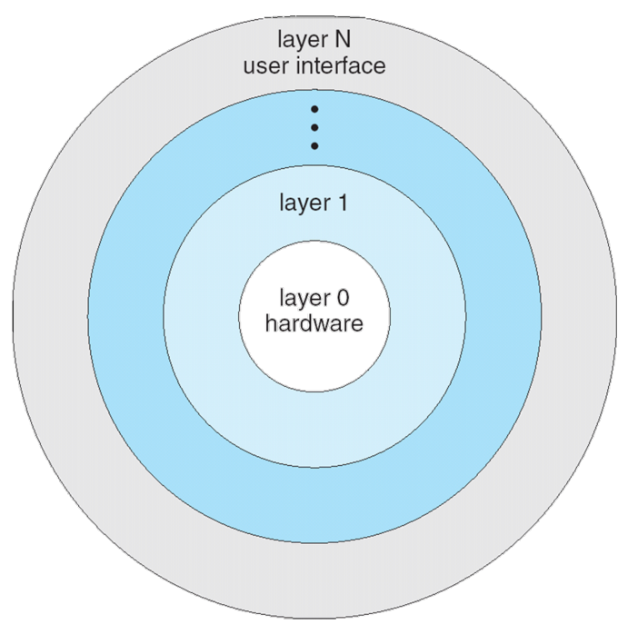
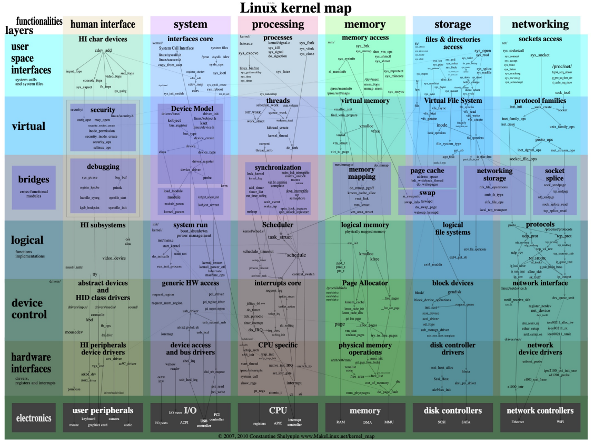
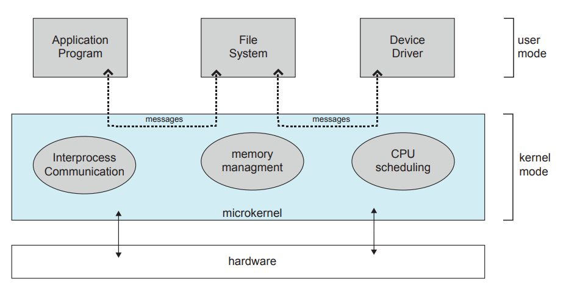

# System Calls

* 운영체제는 시스템을 어떻게 보호하는가?
* 운영체제는 어떻게 효과적으로 동작하는가?

## Protecting the system

사용자가 키보드를 눌렀을 때 발생하는 인터럽트에 접근하여 log 를 빼간다던지, 운영체제에 영향을 미치는 instruction 을 발생시킨다던지  
하는 이슈가 생길 수 있다. 운영체제는 이를 어떻게 방어하고 있을까?

IDT와 같은 중요한 자료구조나 HLT 같은 instruction 은 함부로 사용하지 못하도록 CPU의 중재가 필요하다.  
CPU는 시스템을 보호하기 위해 `user mode` 와 `kernel mode` 를 지원한다.

  * Privileged instructions 은 커널 모드에서만 실행할 수 있다.
  * 유저모드와 커널모드는 `Mode bit` 를 통하여 구분한다.
  * 요즘 컴퓨터는 이 두가지 모드 의외에도 다른 모드를 지원한다.

### Privileged instructions

* 입출력 장치에 직접 접근하는 명령어
* 시스템 레지스터에 접근하거나 조작하는 명령어 `시스템 레지스터로 CPU의 상태를 읽을 수 있다`
* 메모리 상태 관리 명령어
* HLT `시스템을 멈추는 명령어를 뜻한다`

CPU는 커널 모드에서만 위 명령어를 사용할 수 있도록 하기 위해서, 유저 모드에서 Privileged instructions 을 실행하면 `Exception` 을 발생시킨다.

### Interrupt VS Exception

#### Interrupt
  * 하드웨어에서 발생한다
  * 동시에 발생하지 않는다 = 아무때나 발생한다

#### Exception
  * 소프트웨어에서 발생한다 `e.g. division by zero`
  * 동시에 발생한다 = CPU가 명령어 실행시 발생한다
  * trap 과 fault 로 구성된다.
    * trap : 의도되었거나 발생해도 괜찮다고 생각되는 예외
    * fault : 예상치 못한 예외
  * Exception handler 를 통해 IDT 와 거의 유사한 매커니즘으로 처리한다

<br/><br/>

## Transition from User to Kernel Mode

일반 소프트웨어에서 Privileged instructions 을 사용해야 하는 경우가 있다 `e.g. 파일 읽기, 유저의 키를 받음`  
위 명령어들은 커널 모드에서만 실행 가능하므로 유저 모드에서 커널 모드로 바꿔주는 작업을 거친다.  
유저 모드에서 커널 모드로의 진입은 system call / interrupt 를 통한 두가지 방법이 있다.

### 1. By system call

#### Process



1. System call 이라는 인터페이스를 통해 운영체제에 진입한다. `이는 CPU 입장에서는 예상가능하므로 trap 의 과정이다`
2. 유저 모드에서 커널 모드로 스위치한다.
3. trap 에 해당되는 핸들러를 호출한다.
4. 유저가 요청한 결과를 출력한다.
5. 커널 모드에서 유저 모드로 스위치한다.

#### Define

* 운영체제에서 제공하는 프로그래밍 인터페이스이다.
* 일반적으로 C/C++ 과 같은 하이레벨 언어의 형태로 제공한다.
* 운영체제가 제공하는 API 이기 때문에 API 에 맞춰서 콜을 하면 운영체제가 처리해주는 방식이다.
* API 가 제공하는 함수들의 리스트를 시스템 콜이라 한다.
* e.g. Win32 API, POSIX API(UNIX, Linux, Mac OSX), Java API(JVM)

#### Kinds



System calls 는 크게 8가지 정도로 나눌 수 있다.
* program execution : 프로그램을 실행한다.
* I/O operations : I/O 디바이스의 동작을 수행한다.
* file systems : 파일을 읽고 쓴다.
* communication : 데이터를 송/수신 한다.
* resource allocation : 메모리를 관리한다.
* accounting : 메모리, CPU 사용률 등을 카운팅 한다.
* error detection : 시스템의 문제를 찾아낸다.
* protection and security : 파일 등의 권한을 관리한다.

각 call 들 하위에 수많은 함수들이 존재한다. linux 의 경우 3~4백개가 존재하는데 이를 다 알기는 불가능하다.  
manual 페이지를 통해 그때 그때 필요한 기능을 찾고 활용하는 능력을 키우는 것이 중요하다.

#### Result : OS Relationship

유저가 사용하는 소프트웨어에서 critical 한 동작을 요구할 경우 system call 을 통해 운영체제에게 요청하게 된다.  
운영체제는 커널 모드로 스위치시켜 handler 를 통해 request 를 처리해준 후 리턴한다.

#### Example

```.c
#include <stdio.h>
int main() {
  printf("HELLO\n");
  return 0;
}
```

1. 유저는 shell 을 통해 system call 을 호출한다.
2. 운영체제는 커널 모드로 스위치 한 후 handler 를 통해 유저가 요구한 함수를 찾아낸다.
3. 이 경우에는 write() system call 을 동작시킨다.

### 2. By intrrupt

유저 모드에서 프로그램을 동작시키는 중 하드웨어에서 인터럽트를 날렸을 때 아래와 같이 동작한다.

1. 인터럽트가 시스템에 발생한다.
2. CPU는 현재 상태를 저장하고 커널 모드로 진입한다.
3. IDT를 통해 처리한다.
4. 유저 모드로 스위치한다.

<br/><br/>

## OS Implementation

운영체제는 어셈블리 언어로 코딩을 해왔다. 하드웨어를 직접 관리하는데에 가장 적합하기 때문이다.  
하지만 코드가 너무 복잡하고 길어지게 되어 C/C++ 혹은 근래에는 Rust 로 작성하게 된다.  
심지어 Perl, Python 같은 스크립트 언어로도 운영체제를 짜기도 한다. `물론 일부분만`  
기능적인 부분은 하이레벨 언어로 코딩이 가능하지만 레지스터를 직접 관리할 수 없기 때문에 하드웨어를 직접 관리하기위해 지금까지도 어셈블리 언어를 쓴다.  
또 하이레벨 언어는 구현이 빠르지만 일반적인 프로그램을 위해 짜여진 언어이기 때문에 동작이 상대적으로 느리다.

### Operating System Structure

* Simple Structure : MS-DOS
* Layered : Abstraction-based
* Monolithic : UNIX
* Microkernel : Mach

#### MS-DOS



* 멀티태스킹이 없다. -> 백그라운드 잡 기능이 없다.
* 싱글 프로세스이다.
  1. 사용자가 요청하면 프로세스를 만든다.
  2. 실행이 끝나면 원래 상태로 돌아간다.
* Privileged instructions 가 없어서 하드웨어 접근이 자유롭다.

보안이 취약했기 때문에 층을 두어 접근 제한을 두는 쪽으로 설계를 하기 시작했다.

#### Layered Approach



layer 1 에서 하드웨어에 접근이 가능한 구조다.  
레이어는 상위레이어에서 요청을 받아 처리하고 하위레이어에 포워딩한다.

간단한 문제의 처리에도 레이어를 거치고 거쳐가야 하므로 성능이 떨어지는 단점이 있다.

#### Monolithic



다른 프로세스에 한번이 접근 가능하게 처리해주었다.  
모든 레이어가 하나로 묶인 형태가 되었다는 데에서 이름이 유래되었다.

동작의 절차를 생략했다보니 성능은 좋다.  
그러나 스파게티 코드가 되어버려서 유지보수가 힘들다.  
또 보안적으로도 안좋다. 덩어리로 묶여져있다 보니 한군데에서 발생한 문제가 다른 프로세스에도 영향을 주게 되었다.

이로인해 컴돌이들은 간단하게 만드는게 좋지 않을까하는 생각을 하게되었다.

#### Microkernel



프로세스를 나누고 커뮤니케이션 레이어로 연결한 구조다.  
확장성, 보안성이 좋으나 속도는 monolithic 에 비해 떨어지게 되었다.

#### Modules

현대 운영체제들은 `loadable kernel modules` 시스템을 가지고 있다.  
커널의 필요한 기능을 동적으로 불러서 동작시킨다는 특징이 있다.
* 객체 지향적인 접근 방식
* 각 코어가 분리되어 있음
* 커널에 로드되는 방식
* layered 한 형태이지만 유연함을 가지고 있음

#### Hybrid systems

현대 운영체제들은 한가지 형태의 모델만을 쓰지 않는다.  
일반적으로 monolithic + microkernel 의 모델을 일컫는다.
