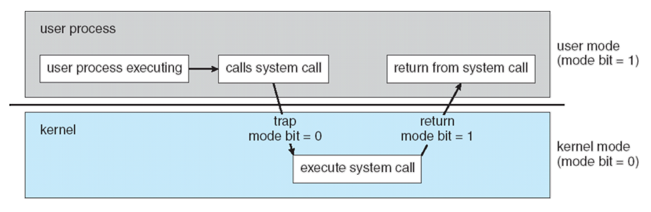
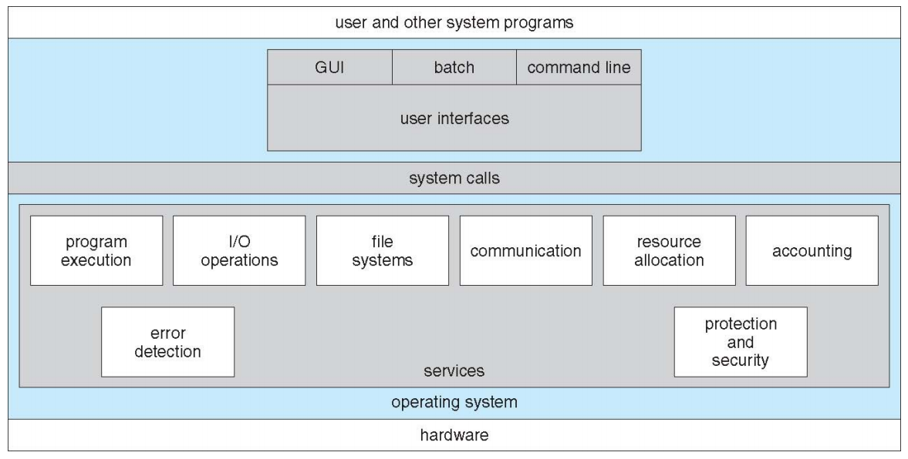
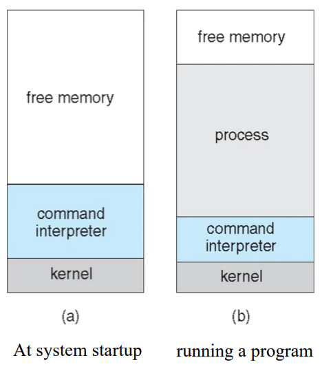
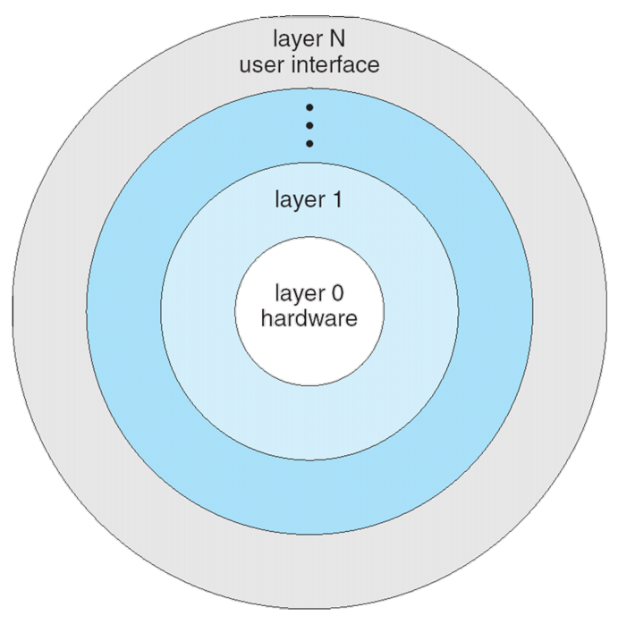

# System Calls

* 운영체제는 시스템을 어떻게 보호하는가?
* 운영체제는 어떻게 효과적으로 동작하는가?

## Protecting the system

사용자가 키보드를 눌렀을 때 발생하는 인터럽트에 접근하여 log 를 빼간다던지, 운영체제에 영향을 미치는 instruction 을 발생시킨다던지  
하는 이슈가 생길 수 있다. 운영체제는 이를 어떻게 방어하고 있을까?

IDT와 같은 중요한 자료구조나 HLT 같은 instruction 은 함부로 사용하지 못하도록 CPU의 중재가 필요하다.  
CPU는 시스템을 보호하기 위해 `user mode` 와 `kernel mode` 를 지원한다.

  * Privileged instructions 은 커널 모드에서만 실행할 수 있다.
  * 유저모드와 커널모드는 `Mode bit` 를 통하여 구분한다.
  * 요즘 컴퓨터는 이 두가지 모드 의외에도 다른 모드를 지원한다.

### Privileged instructions

* 입출력 장치에 직접 접근하는 명령어
* 시스템 레지스터에 접근하거나 조작하는 명령어 `시스템 레지스터로 CPU의 상태를 읽을 수 있다`
* 메모리 상태 관리 명령어
* HLT `시스템을 멈추는 명령어를 뜻한다`

CPU는 커널 모드에서만 위 명령어를 사용할 수 있도록 하기 위해서, 유저 모드에서 Privileged instructions 을 실행하면 `Exception` 을 발생시킨다.

### Interrupt VS Exception

#### Interrupt
  * 하드웨어에서 발생한다
  * 동시에 발생하지 않는다 = 아무때나 발생한다

#### Exception
  * 소프트웨어에서 발생한다 `e.g. division by zero`
  * 동시에 발생한다 = CPU가 명령어 실행시 발생한다
  * trap 과 fault 로 구성된다.
    * trap : 의도되었거나 발생해도 괜찮다고 생각되는 예외
    * fault : 예상치 못한 예외
  * Exception handler 를 통해 IDT 와 거의 유사한 매커니즘으로 처리한다

<br/><br/>

## Transition from User to Kernel Mode

일반 소프트웨어에서 Privileged instructions 을 사용해야 하는 경우가 있다 `e.g. 파일 읽기, 유저의 키를 받음`  
위 명령어들은 커널 모드에서만 실행 가능하므로 유저 모드에서 커널 모드로 바꿔주는 작업을 거친다.  
유저 모드에서 커널 모드로의 진입은 system call / interrupt 를 통한 두가지 방법이 있다.

### 1. By system call

#### Process



1. System call 이라는 인터페이스를 통해 운영체제에 진입한다. `이는 CPU 입장에서는 예상가능하므로 trap 의 과정이다`
2. 유저 모드에서 커널 모드로 스위치한다.
3. trap 에 해당되는 핸들러를 호출한다.
4. 유저가 요청한 결과를 출력한다.
5. 커널 모드에서 유저 모드로 스위치한다.

#### Define

* 운영체제에서 제공하는 프로그래밍 인터페이스이다.
* 일반적으로 C/C++ 과 같은 하이레벨 언어의 형태로 제공한다.
* 운영체제가 제공하는 API 이기 때문에 API 에 맞춰서 콜을 하면 운영체제가 처리해주는 방식이다.
* API 가 제공하는 함수들의 리스트를 시스템 콜이라 한다.
* e.g. Win32 API, POSIX API(UNIX, Linux, Mac OSX), Java API(JVM)

#### Kinds



System calls 는 크게 8가지 정도로 나눌 수 있다.
* program execution : 프로그램을 실행한다.
* I/O operations : I/O 디바이스의 동작을 수행한다.
* file systems : 파일을 읽고 쓴다.
* communication : 데이터를 송/수신 한다.
* resource allocation : 메모리를 관리한다.
* accounting : 메모리, CPU 사용률 등을 카운팅 한다.
* error detection : 시스템의 문제를 찾아낸다.
* protection and security : 파일 등의 권한을 관리한다.

각 call 들 하위에 수많은 함수들이 존재한다. linux 의 경우 3~4백개가 존재하는데 이를 다 알기는 불가능하다.  
manual 페이지를 통해 그때 그때 필요한 기능을 찾고 활용하는 능력을 키우는 것이 중요하다.

#### Result : OS Relationship

유저가 사용하는 소프트웨어에서 critical 한 동작을 요구할 경우 system call 을 통해 운영체제에게 요청하게 된다.  
운영체제는 커널 모드로 스위치시켜 handler 를 통해 request 를 처리해준 후 리턴한다.

#### Example

```.c
#include <stdio.h>
int main() {
  printf("HELLO\n");
  return 0;
}
```

1. 유저는 shell 을 통해 system call 을 호출한다.
2. 운영체제는 커널 모드로 스위치 한 후 handler 를 통해 유저가 요구한 함수를 찾아낸다.
3. 이 경우에는 write() system call 을 동작시킨다.

### 2. By intrrupt

유저 모드에서 프로그램을 동작시키는 중 하드웨어에서 인터럽트를 날렸을 때 아래와 같이 동작한다.

1. 인터럽트가 시스템에 발생한다.
2. CPU는 현재 상태를 저장하고 커널 모드로 진입한다.
3. IDT를 통해 처리한다.
4. 유저 모드로 스위치한다.

<br/><br/>

## OS Implementation

옛날에는 어셈블리로 짰음, 복잡함. 라인이 너무 길어진다. C/C++ 로 작성하게 됨. Rust 로도 만든다.
그러나 C와 같은 언어로는 레지스터를 직접 관리할 수 없기 때문에 하드웨어를 직접 관리하려면 지금도 어셈블리를 쓴다. 기능적인 부분은 C/C++ ...
운영체제의 동작 중 반복되는 부분은 Perl, Python 으로도 작성한다.
왜?
하드웨어를 직접 컨트롤 하기 위해(하이레벨 : 특정 메모리 번지를 지정 불가능)
하이레벨은 코딩하기는 쉽지만 일반적인 프로그램을 만들기 위한 언어라서 동작이 느림

### Operating System Structure

* Simple Structure : MS-DOS
* Monolithic : UNIX
* Layered : Abstraction-based
* Microkernel : Mach

#### MS-DOS



백그라운드 잡 없음, 멀티태스킹 없음, 싱글 프로세스
사용자가 요청하면 프로세스를 만듦 실행이 끝나면 원래대로 돌아감
PI가 없음 하드웨어 접근이 자유로움

OS를 층으로 나누자. 층 별로 접근에 제한을 두자.

Layered Approach



layer 1 에서 하드웨어에 접근 가능
레이어는 상위레이어에서 요청을 받아 처리하고 하위레이어에 포워딩하는 구조

문제가 있음.. 간단한 문제의 처리에도 레이어를 거치고 거쳐 해야하므로 느림.

Monolithic Traditional Linux

효율이 너무 안좋다

레이어를 건너뛰고 직접 접근할 수 있는 경우를 처리하다보니 스파게티 코드가 되어버림

성능은 좋음
유지보수가 힘들다
보안적으로도 안좋다. 덩어리로 묶여져있다 보니 한군데에서 발생한 문제가 퍼지게된다

간단하게 만드는게 좋지 않을까?

Microkernel

프로세스를 나누고 커뮤니케이션 레이어로 연결

확장성, 보안성 좋음

속도는 저하되었음

Modules

커널의 기능을 동적으로 동작시킴

Hybrid systems

monolithic + microkernel
