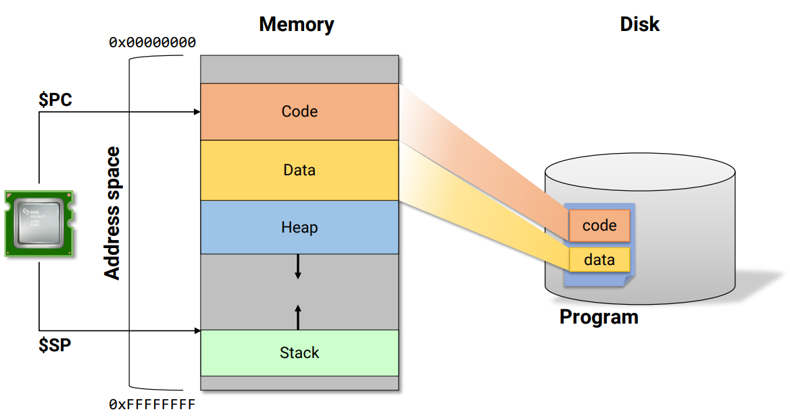
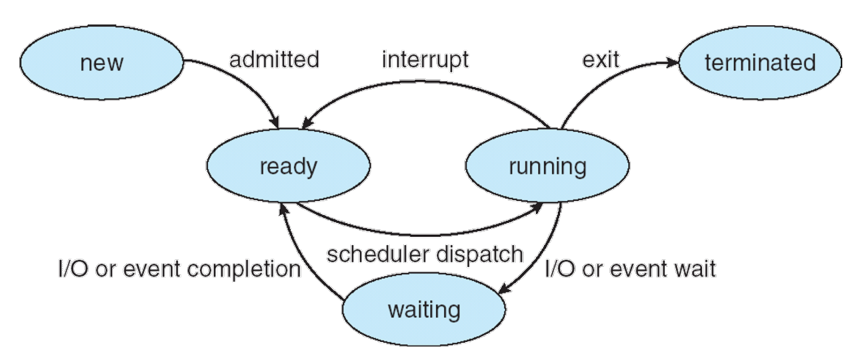
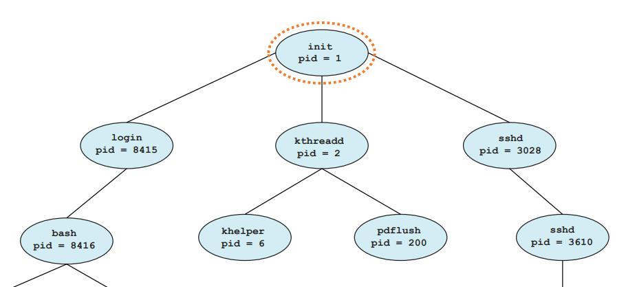
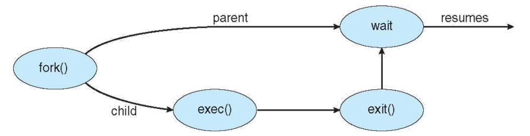

# Process

* 실행중인 프로그램(an instance of a program in execution)
* C++/Java 와 같은 언어에서 `Class` 는 참조할 수 있는 하나의 템플릿으로 `static` 한 성질을 가지고 있다. 이를 `Program` 에 빗댄다면,  
  `Object` 는 new 로 만든 인스턴트 객체로 `dynamic` 하다. 이런식으로 동작하는 객체를 `Process` 에 비유할 수 있다.
* 하나의 프로그램은 여러개의 프로세스가 될 수 있다. (막아놓는 프로그램도 다수 있다 e.g. 게임)
* 각 프로그램은 고유의 process ID(PID)를 가지고 있다.

## From program to process



* 프로그램은 디스크에 저장되어 있다.
* 프로그램을 메모리로 로드한다.
* 실행이 되면서 동적 영역인 Stack(local variable), Heap(dynamic)이 생성된다.
* 이 때 CPU의 Program Counter 는 현재 처리중인 위치를 가리킨다.(코드영역)

## Process in Memory

* 각 프로세스는 메모리에 고유 공간을 갖는다.
* 코드 영역은 테스트 섹션으로도 불린다.
* 전역변수는 데이터 섹션에 저장된다.
* 지역변수, 함수 매개변수, 리턴 변수 등 일시적인 성질의 변수는 스택에 저장된다.
* 실행 중인 동안 동적으로 할당된 메모리는 힙에 저장된다.

### e.g.

```.c
#include <stdio.h>
#include <stdlib.h>

int x;
int y = 10;

int main(int argc, char *argv[]) {
  int *values;
  int i;
  
  values = (int *)malloc(sizeof(int) * 5);
  
  for(i=0; i<5; i++)
    values[i] = i;
    
  return 0;
}
```

* Code : instruction
* Data : x, y
* Heap : *values
* Stack : argc, *argv[], i

## Process State Transitions



* new : 프로세스가 생성된 상태
* ready : 대기중인 프로세스  
  실행중인 컴퓨터에는 대기중인 프로세스가 수십, 수백개가 된다. 이들은 linked list와 같은 형태로 추상화되어 있고 대기중인 이 리스트들을 ready queue 라고 한다.
  ready 된 process 들은 processor 가 한번에 하나씩만 실행할 수 있다. 그래서 scheduler 모듈이 ready process 중 적당한 process 를 dispatch 하고  
  dispatch 된 process 는 running 상태가 된다. 또 interrupt 가 발생한 process 는 ready 상태로 돌아간다.
* running : 실행중인 프로세스
* waiting : 특정 이벤트가 발생하여 대기중인 상태  
  running 상태인 process 에서 scanf 와 같은 함수로 인해 대기중인 경우
* terminated : 실행이 종료된 프로세스

## Process Hierarchy



* 부모 프로세스는 또 다른 자식 프로세스를 만들 수 있다.
* 같은 부모를 둔 자식 프로세스들은 형제이다.
* 프로세스들로 이루어진 트리 형태를 띈다.

## Process Creation

### fork() : system call interface
* 현재 프로세스를 똑같이 클론하여 새로운 프로세스를 만든다.
  부모의 주소 공간을 복사한다.
  
```.bash
$ man fork
성공시 부모에게는 자식의 PID를 리턴하고 자식에게는 0을 리턴한다.  
실패시 부모에게는 -1을 리턴하고 자식 프로세스는 만들어지지 않는다.
```

<hr/>

#### Example
Q1) 프로그램의 출력 결과는?
```.c
#include <stdio.h>
#include <sys/types.h>
#include <unistd.h>

int main(int argc, const char *argv[]) {
  fork();
  
  printf("Hello world\n");
  return 0;
}
```

A)
```.c
Hello world
Hello world
```

<br/><br/>

Q2) Hello world가 몇번 출력되나요?
```.c
#include <stdio.h>
#include <sys/types.h>
#include <unistd.h>

int main(int argc, const char *argv[]) {
  fork();
  fork();
  fork();
  
  printf("Hello world\n");
  return 0;
}
```

A) 2<sup>3</sup> = 8

<br/><br/>

Q3) 프로그램의 출력 결과는?
```.c
#include <stdio.h>
#include <sys/types.h>
#include <unistd.h>

void forkexample() {
  int x = 1;
  if (fork() == 0) {
    printf("Child has x = %d\n", ++x);
  } else {
    printf("Parent has x = %d\n", --x);
  }
}

int main(int argc, const char *argv[]) {
  forkexample();
  return 0;
}
```

A)
```.c
Parent has x = 0
Child has x = 2
```

<br/><br/>

Q4) 프로그램의 출력 결과는?
```.c
#include <stdio.h>
#include <sys/types.h>
#include <unistd.h>

int x = 3;

int main(int argc, const char *argv[]) {
  while(x--) {
    fork();
    printf("%d", x);
  }
  
  return 0;
}
```

A) 순서대로 출력되지는 않는다
```.c
22111100000000
```

<br/><br/>

## Replace Process Image

### exec() family

* 현재 프로세스의 상태를 갈아치우는 시스템 콜
* 현재 주소 공간은 모두 버려지고 재구축된다.
* variants 들이 존재한다.

## Process Termination

* Voluntary
  * Normal exit
  * Error exit
* Involuntary
  * Fatal error
  * 다른 프로세스에 의해 종료된다(시그널을 받음)

### exit()

시스템 콜 호출시 CPU가 해당 프로세스의 자원을 모두 해제시키고 종료시킨다.  
이 때 main() 함수에서 return 한 return code 는 남아있게 되는데 이는 누군가 가져갈 때 까지 살아있다.  
이 프로그램이 종료되기를 기다리는 프로세스는 wait 혹은 waitpid 함수를 통해 return code 를 받을 수 있다.
return code 를 넘겨받은 프로세스가 생긴다면 exit() 를 부른 프로세스는 완전히 종료된다.

### wait(), waitpid()

자식 프로세스가 종료될 때까지 부모 프로세스는 block 상태로 기다린다.  
자식 프로세스가 종료할 때 실행한 exit() 를 통해 return code 를 받을 수 있다.

### abort(), kill()

시그널을 통해 다른 프로세스를 종료시킨다.

#### Zombie process

프로세스는 종료되었지만 wait() 함수가 아직 호출되지 않은 프로세스

#### Orphan process

wait() 함수 호출 없이 종료된 부모 프로세스를 가진 자식 프로세스

solution
* cascading termination : 남은 자식 프로세스를 모두 종료시킨다(과격한 방식이라 자주 사용되지는 않음)
* reparenting : 고아 프로세스를 다른 프로세스에게 입양보내는 방식(리눅스, 유닉스에서 잘 사용된다)

## Process Cycle


