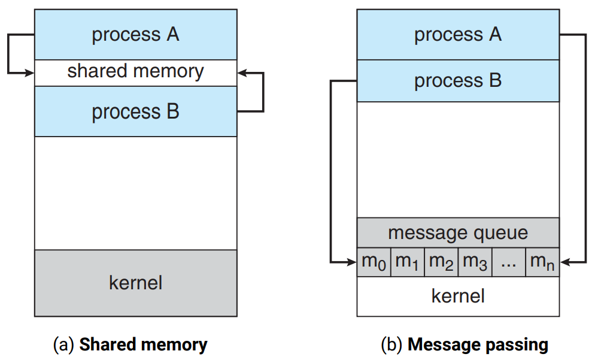
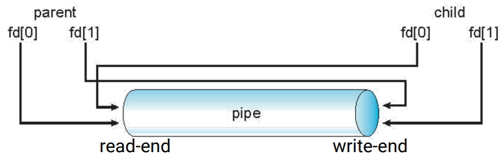

# Inter-Process Communication (IPC)

시스템의 프로세스들은 독립적이거나 협동적인 관계를 유지하고 있다.

### Example : Multiprocess Architecture - Chrome Browser


탭 하나하나가 서로 다른 프로세스가 구현된 형태이다.  
UI, network I/O 들을 다루는 프로세스, 렌더링하는 프로세스, 확장프로그램을 다루는 프로세스 등도 서로 다른 프로세스이다.

## Inter-Process Communication Models



### Shared memory

각 프로세스는 독립된 주소 공간을 가진다. (다른 프로세스의 공간에 접근하지 못한다)
프로세스들은 시스템 콜을 통해 CPU 에게 shared memory 를 할당받고 조인할 수 있다.

* 장점 : 통신 중에는 운영체제가 관여하지 않기 때문에 성능이 좋다.
* 단점 : 프로세스들이 알아서 synchronize 하여 통신하는 것이 쉬운 일은 아니다.

### Message passing

운영체제에서 메세지 기능을 제공한다. (메세지를 보내는 시스템 콜, 메세지 알림 시스템 콜 등)  
프로세스는 운영체제에게 메세지를 보내달라고 요청한다. 운영체제는 요청에 맞게 메세지를 전달해준다.  

* 장점 : synchronize 문제를 프로세스가 고민하지 않아도 된다.  
  코드가 간결하다.
* 단점 : 속도가 느리다.

## Signals

* 특정 이벤트를 프로세스에게 알리는 IPC 매커니즘
* synchrozine or asynchronize
* software interrupt 로 여겨진다.
* 운영체제는 프로세스에게 시그널을 전달한다.
* 프로세스들은 서로 다른 signal handler 를 가지고 있다.

### manual

```.bash
$ man 7 signal
```

2 : system call  
...  
7 : overview  

7 signal 로 검색하면 간략한 리스트를 먼저 확인할 수 있다.

## Pipes

* 두 프로세스가 통신하는 통로
* 초기 유닉스에서 첫번째로 만들어진 IPC 매커니즘
* ordinary pipes vs named pipes

### 종류

* 양방향(bidirectional) 통신, 단방향(undirectional) 통신이 있다.
* 양방향 통신은 송/수신을 동시에 할 수 없는 경우(half-duplex), 동시에 할 수 있는 경우(full-duplex)로 나뉜다.

### Ordinary Pipes



```.bash
$ cat data | sort | uniq -c; git diff | grep -e "^+" | wc -l
```

| : ordinary pipe

* unidirectional 이다.
* parent, child 간에만 생성될 수 있다.

#### File descriptor

프로세스가 만들어지면 기본적으로 3개의 file descriptor 가 생긴다.  
이 3개는 0:stdin, 1:stdout, 2:stderr 이다.


#### Example : Ordinary Pipes

```.c
#include <sys/types.h>
#include <sys/wait.h>
#include <stdio.h>
#include <stdlib.h>
#include <unistd.h>
#include <string.h>

int main(int argc, char *argv[]) {
  /* pipefd[0] for read, pipefd[1] for write */
  int pipefd[2];
  pid_t cpid;
  char buf;
  
  if (pipe(pipefd) == -1) {
    perror("pipe");
    exit(EXIT_FAILURE);
  }
  
  cpid = fork();
  if (cpid == 0) {
    close(pipefd[1]); /* Close unused wirte end */
    
    while(read(pipefd[0], &buf, 1) > 0)
      write(STDOUT_FILENO, &buf, 1);
      
    write(STDOUT_FILENO, "\n", 1);
    close(pipefd[0]);
    exit(EXIT_SUCCESS);
  } else {
    close(pipefd[0]); /* Close unused read end */
    
    write(pipefd[1], argv[1], strlen(argv[1]));
    close(pipefd[1]);
    wait(NULL);
    exit(EXIT_SUCCESS);
  }
  
  return 0;
}
```

```
parent write() -> child read()  
child write() -> parent read()
```

분명 두 프로세스만 연결해주는 파이프인데, 부모-자식 간에는 파이프 통신이 가능하다.

### Named Pipes

* Ordinary pipes 보다 강력하다.
  * 양방향 통신이다.
  * 부모-자식의 관계가 아니어도 된다.
  * 여러 프로세스들이 named pipe 를 사용할 수 있다.
  * 프로세스가 종료되어도 named pipe 는 살아있다.
* 유닉스와 윈도우즈에서 제공한다.

## Remote Procedure Calls (RPCs)

같은 아키텍처를 사용하는 컴퓨터라는 보장이 없다.

### Endianness

* Big-endian : 작은 메모리 번지에 큰 자리의 수 저장(ARM, MIPS, ...)
  * 캐스팅시 불편한 점이 많다.
* Little-endian : 작은 메모리 번지에 작은 자리의 수 저장(현대 대부분의 컴퓨터)
  * 사람이 보는 값 : 0x 01 23 45 67 89 ab cd ef
  * 저장되는 값    : 0x ef cd ab 89 67 45 23 01

