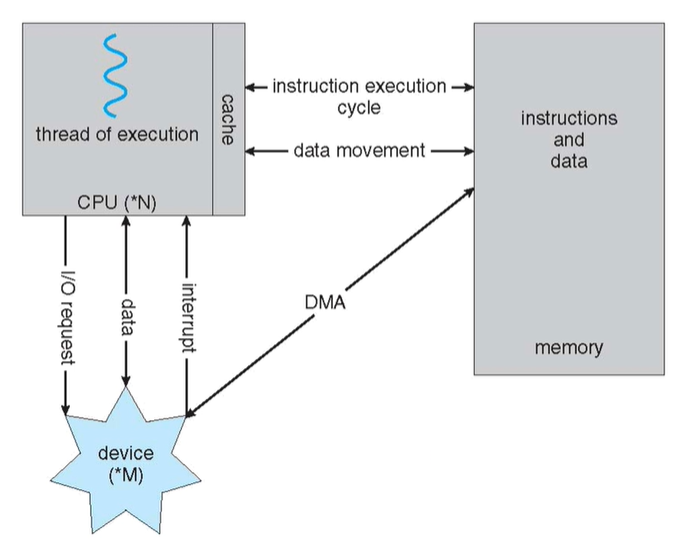

# Introduction to Operating Systems

* Operating System
* Computer Architecture
* CPU

## Operating System?

* 유저와 컴퓨터 하드웨어 사이를 중재하는 역할을 하는 '프로그램'을 말한다.  
`하드웨어 : 기본적인 컴퓨터 동작을 하는 자원이나 기기를 말한다. ex) CPU, 메모리, 입출력기기`

* 하드웨어 자원을 제어하고 조정한다.

### What operating systems do?

* 프로그램을 실행하고 문제 해결에 도움을 준다.
* 컴퓨터를 편안히 사용가능하게 한다.
* 두가지 관점에서 정의할 수 있고 다음과 같다.
  * Application/user 관점
  
    * 자원 관리를 하지 않고도 좋은 성능을 낼 수 있게한다.
    * 쉬운 사용방법을 제공한다.
    * 컴퓨터 시스템 기반의 관점을 사용자에게 제공한다.
      * 프로세서 -> 프로세스, 쓰레드
      * 메모리 -> 가상 메모리 주소 공간
      * 저장소 -> 용량, 디렉토리, 파일
      * 입출력기기 -> 파일(입출력제어)
      * 네트워크 -> 파일(소켓, 파이프)

  * System 관점
    
    * 많은 사용자가 참여하는 애플리케이션을 다룬다.
    * 자원 관리의 역할을 한다.
      * CPU, 메모리, 입출력기기, 전력 등을 다룬다.
    * 프로그램을 관리한다.
      * 에러를 예방하고 컴퓨터의 부적절한 사용을 방지한다.

## Computer system architecture

초기의 컴퓨터의 경우는 입력과 출력에 대한 배선 연결이 무수히 많이 되어있었다.  
하드웨어적인 프로그래밍 방식이었으며 따라서 새로운 작업을 하려면 물리적인 작업을 거쳐야했다.  
`브래드보드에 칩과 선을 이용한 카운터, 가산기 등이 그 예이다`  
이런 배경속에 하드웨어를 건드리지 않고 가변적인 시스템을 처리하는 아키텍처가 등장하게 되었다.

### 폰노이만 구조

* 프로그램 내장방식이다.  
`다른 기능을 수행하기 위해 회로를 직접 조정하던 예전과는 달리 메모리안에 소프트웨어가 내장되어 있다.`
* CPU / memory 가 따로 존재한다.
  * CPU는 memory로 부터 instruction을 가져와서 처리한다.
  * 복잡한 배선이 CPU안에 다 내장되어 있다.
  * 계산 결과를 다른 장치에 전달한다.
* CPU가 순차적으로 명령어 하나씩 실행한다.

#### 단점
* 폰노이만 병목현상(Bottleneck) - 프로그램 메모리와 데이터 메모리가 물리적 구분없이 하나의 버스를 통해 CPU와 교류하기 때문에 계산속도가 기억장치 속도에 영향을 받는다. 기억장치 속도 저하에 따라 전체 시스템의 성능 저하를 일으키는 현상을 Bottleneck 이라 한다.
* 한 번에 하나씩의 명령어를 처리하기 때문에 CPU자원의 낭비가 생긴다.

## CPU(Central Processing Unit)
* 프로세서라고도 부른다.
* 대부분은 일반적인 목적을 가진 프로세서이다. `intel i5/i7, AMD, xeon, ...`
* 특수 목적을 가진 프로세서도 존재한다. `hardware accelerators`
  * GPU(Graphic Processing Unit)
  * TPU(Tensor Processing Unit) : `머신러닝을 위한 프로세서`

#### 멀티프로세서/멀티코어 등장 배경
> CPU는 전기를 써서 동작하는데 필연적으로 물리적인 열이 발생하게 된다.  
> 점점 칩의 크기는 작아지고 처리하는 양은 많아지면서 CPU의 열이 과도하게 발생하게 되었다.  
> 때문에 전력은 유지하면서 전압을 낮추는 방식으로 개선하기 시작했다.  
> 하지만 어느순간부터 더 이상 전압을 낮추면 전류가 새어버리는 지점에 도달했고, 이 방법을 더이상 사용하기는 어려워졌다.  
> (이 현상을 전력 장벽(Power Wall)이라 한다)  
> 이 벽을 넘기 위해 코어의 개수를 늘려가면서 성능을 올리는 방식으로 바뀌게 되었다.

### Multiprocessor Systems
* 여러개의 프로세서가 있는 시스템을 뜻한다
* 병렬시스템(parallel system) 이라고도 한다.
  * 공용 자원을 통한 자원 효율성 향상
  * 안정성 향상: 성능/결함 저하

### Multiprocessor Systems Classification
* Asymmetric Multiprocessing (비대칭형 다중 처리)
  * 각 프로세서는 특정 업무를 할당받는다. (Boss-worker relationship)
* Symmetric Multiprocessing(SMP) (대칭형 다중 처리)
  * 각 프로세서는 모든 업무를 수행한다.
  * 일반적인 컴퓨터의 처리 방식이다.
* Single-chip multiprocessor(multicore)
  * 한 칩 안에 여러개의 코어(대부분 SMP)가 들어있는 시스템
  * 코어 사이에 공용자원 공유와 가까운 거리를 통해 성능이 향상됨

#### Uniform Memory Access architecture vs Non-Uniform Memory Access architecture

> UMA : 모든 프로세서가 단일 메모리를 사용, 동일한 메모리 액세스 시간/속도  
> NUMA : 각 프로세서를 전용 메모리에 연결, 단일 주소 공간, 메모리 액세스 시간은 프로세서가 배치되는 거리에 따라 달라짐
>
> UMA vs NUMA
>
> UMA 아키텍처는 메모리에 액세스하는 프로세서에 대해 동일한 전체 대기 시간을 제공한다. 
> 대기 시간이 일정하기 때문에 로컬 메모리에 액세스 할 때는 그리 유용하지 않다. 
> 반면 NUMA에서는 각 프로세서에 전용 메모리가있어 로컬 메모리에 액세스 할 때 대기 시간이 필요하지 않다. 
> 대기 시간은 프로세서와 메모리 사이의 거리가 바뀌면 변경된다 (즉, 비 균일). 그러나 NUMA는 UMA 아키텍처에 비해 성능을 향상 시켰다.

### Computer System Organization

* Device controller(DC)들은 공유메모리에 접근할 수 있게하는 공용 버스를 통해 연결되어있다.
* Concurrent execution of CPUs and devices compete for memory cycles
* 각각의 DC는 서로 다른 타입의 기기를 다룬다.
* 각각의 DC는 로컬버퍼를 갖는다.
* 입력은 디바이스에서 컨트롤러의 로컬버퍼로 가는 과정이다.
* 출력은 컨트롤러의 로컬버퍼에서 디바이스로 가는 과정이다.
* CPU와 DC는 메인메모리/로컬버퍼에서 로컬버퍼/메인메모리로 데이터를 보낸다.

#### CPU가 I/O device 에 request 요청했을때 그 완료시기는 어떻게 알 수 있을까?
> DC는 인터럽트를 발생시킴으로써 CPU에게 신호를 준다.
>  * 입출력장치에 요청이 발생했을 때
>  * 요청을 다 끝냈을 때
> CPU는 interrupt-request line을 통해 인터럽트를 감지한다.

### Common Functions of Interrupts

* CPU는 인터럽트를 감지하면 동작한다.
  * Interrupt service routine, interrupt handler routine, interrupt handler
* Interrupt vector 혹은 Interrupt Descriptor Table(IDT)는 모든 service routine들의 주소를 가지고 있다.
* CPU는 받은 인터럽트의 번호/ID와 IDT를 통해 인터럽트 핸들러를 찾는다.
  * IDT는 조건에 따른 동작방식이 메모리에 저장되어있다.

10101010 : Interrupt handler

* The device controller raises an interrupt
  * By asserting a signal on the interrupt request line
* CPU catches the interrupt, and dispatches it to the interrupt handler
* What CPU do after serving the interrupt request? What happed to the currently running program?

CPU : 자기의 일을 수행함 -> 주변장치에서 인터럽트 발생(핀에 시그널을 통해 앎) -> IDT에 정의되어 있는 i.handler를 처리 -> 자기의 일을 수행함

* Systems perserve the current state of the CPU
  * To come back after handling the interrupt
  * Save registers and the address of the interrupted instruction
  * Done by HW or/and operating systems
* Return to the last state by restoring the registers

CPU는 로컬버퍼에 접근 X, 메인메모리에만 접근할 수 있음

Storage Structure
* Main memory
  * Only storage media that the CPU can access directly
    * i.e., CPU cannot read data from disks directly
  * Random access, byte addressable
  * Typically volatile

* Secondary storage(disk)
  * Extension of main memory that provides large non-volatile storage capacity
  * Block addressable

---

Storage Definitions and Notation

* Bit = 0 or 1, bygte = 8bits
* Word = A computer architecture's native unit of data
  * 32-bit architecture: 32bits = 8 x 4bits = 4bytes = 1word
  * 64-bit architecture: 64bits = 8bytes = 1word

* Multiple bytes
  * Kilo = 1024 = 2^10
  * Mega = 1024 x 1024 = 2^20
  * Giga = 1024 x 1024 x 1024 = 2^30
  * Tera, peta, exa, zeta, yotta, ...

Tip calculating 2n

236 = 230+6 = 230 x 26 = Giga * 64 = 64Giga

222 = 220+2 = 220 * 22 = Mega * 4 = 4Mega

29 = 210-1 = 210 / 21 = Kilo / 2 = 512Bytes
